# FleetOS Tenant App (LIMOZ Rwanda) — Reference Application Analysis & Feature Inventory

**Source:** static HTML/JS prototype ("FleetOS · App B (Tenant)", branded *LIMOZ Rwanda · Fleet Operations · Kigali*).
**Analysed artefacts:** `condensed.txt` (all page scripts + `ops-data.js` + `appb-pages.js`), `tenant-shell.js`, `tenant-data.js`, raw `pages/*.html`.
**Not available for analysis:** the seed-data assets `billing-data.js` (`BillData`), `deployments-data.js` (`DeployData`), `garage-data.js` (`GarageData`), `maint-data.js` (`MaintData`), `reports-data.js` (`ReportsData`) and `reports.js` (`Reports.renderReport`). Their contents are **inferred** from how the pages consume them and are flagged *(inferred)* throughout.
**Not present in the prototype:** `Gate Pass.html`, `Work-Done Form.html` (linked from Work Progress but missing), `billdetail` and `newbill` (both return a Netlify 404 page).

Every label, column header, option value and placeholder below is quoted from the source. Anything not literally in the source is marked **inferred**.

---

## 1. Overview

### 1.1 What the prototype is

A click-through prototype of a multi-tenant fleet-operations SaaS ("FleetOS", platform URL `rwanda-transit.fleetplatform.com`, "White-Label plan") configured for one tenant, **LIMOZ Rwanda Ltd** (the shell brand) — the underlying seed data still carries the earlier brand *Rwanda Transit Ltd* (`TenantData.PROFILE`, user e-mails `@rwandatransit.rw`). The business is a Kigali-based **passenger/cargo vehicle hire company** serving corporate clients (Bralirwa, MTN Rwanda, RwandAir, University of Rwanda, Bank of Kigali, Kigali City Council, Inyange Industries) under framework contracts ("Commitments") backed by client Local Purchase Orders (LPOs). It covers:

* Fleet master data (vehicles, drivers) and a 14-day availability calendar.
* Client bookings → deployments (slot assignment of vehicle + driver + shift) → roadmap PDF → deployment voucher with trip readings and owner/institution amounts.
* Maintenance in two parallel models: (a) *Maintenance Jobs* (`MNT-…`, internal/external garage, spare-part approval, labour + parts cost, payment) and (b) a *Garage workshop flow* (`GRG/…`: vehicle intake → mechanic review → work progress → completed → released/gate pass).
* Spare-parts inventory and stock movements.
* Finance: bills/invoices (draft → sent → partial/overdue → paid, VAT 18 %, RWF/USD), payments in/out, fuel log, expenses.
* Compliance: certificates (insurance / RURA permit / inspection), traffic fines, accidents.
* Reports: Technical, Fuel GSL, Deployment (date range, filters, CSV export).
* Settings: company profile + terminology, users & roles, audit log, notification preferences.

All state is in-memory or `localStorage` (`fleetos_ops_bookings_v1`, `fleetos_ops_status_v1`, `fleetos_tenant_onboarding_v1`, plus `saveOverride` for invoices and jobs). There is no real backend.

### 1.2 Enabled / disabled modules (`tenant-shell.js` → `ENABLED`)

| Module key | Enabled | Sidebar items gated by it |
|---|---|---|
| `vehicles` | **true** | Vehicles |
| `drivers` | **true** | Drivers |
| `clients` | **true** | Clients |
| `bookings` | **true** | Bookings |
| `deployments` | **true** | Deployments, Deployment Voucher |
| `maintenance` | **true** | Jobs, Spare Parts, Stock Movements, Garage Dashboard, Vehicle Intake |
| `billing` | **true** | Bills, Payments, Fuel Log, Expenses |
| `compliance` | **true** | Certificates, Traffic Fines, Accidents |
| `commitments` | **true** | Commitments |
| `lpos` | **true** | LPOs |
| `analytics` | **true** | Technical Report, Fuel GSL Report, Deployment Report |
| `routes` | **false** | Routes (hidden) |
| `trips` | **false** | Trips (hidden) |
| `core` | always on | Dashboard, Company Profile, Users & Roles, Audit Log, Notifications |

Implication for the backend: tenant-level **module flags** drive navigation; `routes` and `trips` exist as concepts (terminology list includes "Trip" and "Route") but have no screens.

### 1.3 Global shell features (every page)

| Feature | Exact behaviour in source |
|---|---|
| Sidebar | Brand block "LIMOZ Rwanda / Fleet Operations · Kigali"; grouped nav (groups: *(none)*, Fleet, Operations, Clients, Maintenance, Garage, Finance, Compliance, Reports, Settings); active item highlighted; footer user card **"NIYOMUGABO J.Claude — Administrator"** (avatar "NJ") with chevrons-up-down (user menu, no behaviour). |
| Top bar | Search box placeholder **"Search vehicles, drivers, bookings…"** with `⌘K` hint (no behaviour wired); icon buttons **Help** (life-buoy) and **Notifications** (bell) — no behaviour. |
| `confirmDialog(opts)` | Modal with icon/tone (`brand`/`danger`/`warn`), title, body, buttons `cancel` (default "Cancel") and `confirm` (default "Confirm"); `danger:true` renders solid red confirm. Escape/scrim click = cancel. Used by Cancel booking, Approve pending parts. |
| `toast(msg,{icon,duration})` | Bottom toast, default icon `check-circle`, auto-dismiss 2.6 s. Used after every mutation. |
| `formDialog` (appb-pages.js) | Generic create-record modal: fields of type `text` (default), `number`, `email`, `textarea`, `select`, `file`; `required` → red `*`, client-side "N required field(s) missing" toast and `is-invalid` highlighting; `full` = full-width; `hint`; `placeholder`; `value` default; submit label per page. |
| `renderListPage` (appb-pages.js) | Standard list page: page-head (greet / title / sub / action buttons), KPI grid (`kpi-grid`), toolbar with search input (`searchPlaceholder`, `searchFields`), `<select>` filters (first option is "All …"), **Export** ghost button (download icon, no behaviour), table, empty state (`empty.icon/title/text`), footer **"Showing N {unit}(s)"** + pager (‹ 1 › — static, page 1 only), optional clickable rows (`rowHref`) with chevron column. |
| Pagination | Every list has the same non-functional pager (prev disabled, "1" current, next). No page size. |
| Export buttons | "Export" on all list pages; "Export log" on Audit Log; report pages have `exportName` (`LIMOZ-Deployment-Report`, `LIMOZ-Fuel-GSL-Report`, `LIMOZ-Technical-Report`) and per-column `exp` getters → **CSV/XLSX export (inferred)**. |
| "Preview state" / "Walk lifecycle" segmented controls | Demo-only switches on Deployment Detail, Invoice Detail, Job Detail, Dashboard to show the screen in each lifecycle state. Not a product feature. |
| Money format | `money(n,cur)`: thousands separator, `"1,234 RWF"` or `"$1,234"`; USD→RWF conversion hard-coded at **1 USD = 1300 RWF** (payments, commitments, LPOs) and `B.USD_RATE` *(inferred same value)* in billing. |
| Dates | Display format `dd MMM yyyy` (`"08 Jun 2026"`) or `dd MMM`; inputs use `type="date"` (ISO) on New Booking / New Job, free-text elsewhere. "Today" is hard-coded as **08 Jun 2026** (list dialogs) / **04 Jun 2026** (invoice creation, dashboard). |
| Status badges | `badge-available`, `badge-deployed`, `badge-maintenance`, `badge-out`, `badge-overdue`, `badge-done`, `badge-billing` tone classes. |

---

## 2. Navigation map

### 2.1 Sidebar screens and reachable sub-pages

| Sidebar group | Label (nav key) | File route (`HREF`) | Page key in source | Sub-pages reachable from it |
|---|---|---|---|---|
| — | Dashboard (`dashboard`) | `../journey-2/Dashboard.html` | dashboard | "Add vehicle", "New booking", "View all" (no targets wired) |
| Fleet | Vehicles (`vehicles`) | `../app-b/Vehicles.html` | vehicles | — (Add vehicle = placeholder toast) |
| Fleet | *(not in sidebar)* Vehicle availability | `Availability Calendar.html` | availability | → Bookings, → New Booking |
| Fleet | Drivers (`drivers`) | `../app-b/Drivers.html` | drivers | Add driver dialog |
| Fleet | Routes (`routes`) | — | — | **disabled module** |
| Operations | Bookings (`bookings`) | `../journey-3/Bookings.html` | bookings | → Availability Calendar, → New Booking, row → Booking Detail |
| Operations | *(sub)* New Booking | `New Booking.html` | newbooking | 4-step wizard → Booking Detail; step 3 → Availability Calendar |
| Operations | *(sub)* Booking Detail | `Booking Detail.html?ref=` | bookingdetail | → Deployment Detail, → New Booking (Edit), tabs Overview/Deployment/Payments/Bills |
| Operations | Deployments (`deployments`) | `../app-b/Deployments.html` | deployments | row → `../journey-3/Deployment Detail.html?ref=` |
| Operations | *(sub)* Deployment Detail | `Deployment Detail.html?ref=&state=` | depdetail | → Booking Detail; pickers Assign vehicle / Assign driver |
| Operations | Deployment Voucher (`depvoucher`) | `../app-b/Deployment Voucher.html?no=` | depvoucher | → Deployment Report; inline "Record return" edit form |
| Operations | Trips (`trips`) | — | — | **disabled module** |
| Clients | Clients (`clients`) | `../app-b/Clients.html` | clients | Add client dialog |
| Clients | Commitments (`commitments`) | `../app-b/Commitments.html` | commitments | New commitment dialog |
| Clients | LPOs (`lpos`) | `../app-b/LPOs.html` | lpos | Raise LPO dialog (with file upload), inline "Attach LPO" |
| Maintenance | Jobs (`jobs`) | `../journey-4/Maintenance.html` | jobs | → New Job, row → Job Detail |
| Maintenance | *(sub)* New Job | `New Job.html` | newjob | → Job Detail |
| Maintenance | *(sub)* Job Detail | `Job Detail.html?ref=` | jobdetail | tabs Overview / Spare Parts / Costs / Payment; dialogs Add spare part, Record payment |
| Maintenance | Spare Parts (`parts`) | `../app-b/Spare Parts.html` | parts | Add part dialog |
| Maintenance | Stock Movements (`stock`) | `../app-b/Stock Movements.html` | stock | Record stock movement dialog |
| Garage | Garage Dashboard (`garage`) | `../app-b/Garage Dashboard.html` | garage | → Vehicle Intake, row → Work Progress |
| Garage | Vehicle Intake (`gintake`) | `../app-b/Vehicle Intake.html` | gintake | success → Mechanic Review, → Garage Dashboard |
| Garage | *(sub)* Mechanic Review | `Mechanic Review.html?id=` | mechreview | → Work Progress, → Garage Dashboard |
| Garage | *(sub)* Work Progress | `Work Progress.html?id=` | workprogress | → Mechanic Review, → `Gate Pass.html?id=` *(missing)*, → `Work-Done Form.html?id=` *(missing)* |
| Finance | Bills (`bills`) | `../journey-5/Bills.html` | bills | → Generate Invoice (`?ready=`), row → Invoice Detail |
| Finance | *(sub)* Generate Invoice | `Generate Invoice.html?ready=` | geninvoice | → Invoice Detail |
| Finance | *(sub)* Invoice Detail | `Invoice Detail.html?ref=` | invoicedetail | Record payment modal; → Bills |
| Finance | Payments (`payments`) | `../app-b/Payments.html` | payments | Record payment = placeholder toast |
| Finance | Fuel Log (`fuel`) | `../app-b/Fuel Log.html` | fuel | Log refuel dialog |
| Finance | Expenses (`expenses`) | `../app-b/Expenses.html` | expenses | Add expense dialog |
| Compliance | Certificates (`certs`) | `../app-b/Certificates.html` | certs | Add certificate dialog |
| Compliance | Traffic Fines (`fines`) | `../app-b/Traffic Fines.html` | fines | Log fine = placeholder toast |
| Compliance | Accidents (`accidents`) | `../app-b/Accidents.html` | accidents | Report accident dialog |
| Reports | Technical Report (`rep_tech`) | `../app-b/Technical Report.html` | rep_tech | — |
| Reports | Fuel GSL Report (`rep_fuel`) | `../app-b/Fuel GSL Report.html` | rep_fuel | — |
| Reports | Deployment Report (`rep_dep`) | `../app-b/Deployment Report.html` | rep_dep | row → Deployment Voucher |
| Settings | Company Profile (`profile`) | `../app-b/Company Profile.html` | profile | — |
| Settings | Users & Roles (`users`) | `../app-b/Users.html` | users | Invite user dialog |
| Settings | Audit Log (`audit`) | `../app-b/Audit Log.html` | audit | — |
| Settings | Notifications (`notif`) | `../app-b/Notifications.html` | notif | — |

Also `HREF.depreport` = `../app-b/Deployment Report.html` (duplicate alias of `rep_dep`).

### 2.2 Mermaid flowchart

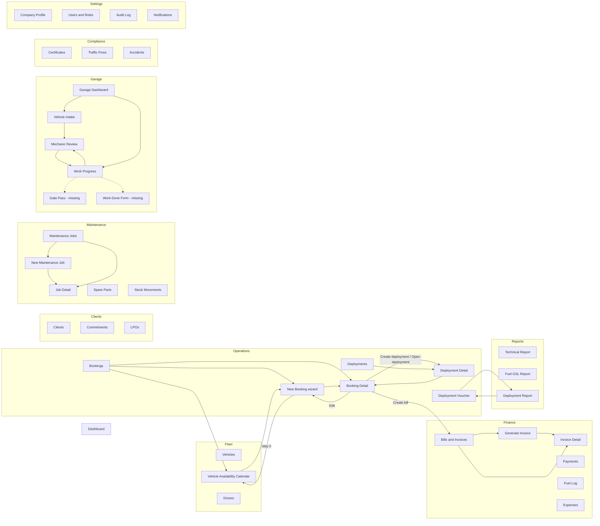

---

## 3. Per-screen inventory

Each screen uses the same 18 points. "Backend data required" names the entities/fields; roles are **inferred** from the role list (`Administrator, Fleet Manager, Dispatcher, Accountant, Compliance Officer, Viewer`) plus garage personas visible in the UI (`Receptionist`, `Mechanic`, account/fuel manager).

### 3.1 Dashboard

1. **Page name:** Dashboard (`<title>Dashboard · LIMOZ Rwanda`).
2. **Route:** `../journey-2/Dashboard.html` (nav key `dashboard`).
3. **Purpose:** Landing page; fleet health at a glance with two demo modes ("Empty" first-run vs "In use").
4. **Information displayed:** Greeting "Welcome to LIMOZ Rwanda" / "Good morning, J.Claude"; eyebrow "Getting started" / "Wednesday · 4 June 2026 · Kigali"; panels *Today's deployments*, *Priority actions*, *Fleet utilisation*, *Recent bookings*; empty-state widgets with CTAs.
5. **Cards/KPIs:** `Total vehicles` (48, sub "+3 this quarter"), `Available` (17, badge "Ready to deploy"), `Deployed` (26, "54% utilisation"), `In maintenance` (5, "2 overdue service").
6. **Table columns:** Today's deployments: `Vehicle` (plate + category), `Driver`, `Route` (e.g. "Kigali → Huye", sub "Dep. 08:30"), `Status` (Deployed / Loading).
7. **Filters:** none (mode segmented control "Empty" / "In use" is demo-only).
8. **Search fields:** none (global search box only).
9. **Buttons/actions:** `Add vehicle` (primary), per-priority-action buttons `Renew`, `Schedule`, `Pay`; links `View all`; empty CTAs `Add a vehicle`, `Add vehicles`, `New booking`.
10. **Forms:** none.
11. **Charts:** Fleet utilisation stacked bar with legend Available 17 / Deployed 26 / Maintenance 5 / Out of service 0; empty state icon `pie-chart`.
12. **Status values:** deployment row status `Deployed`, `Loading`; recent-booking badges `Confirmed`, `Pending`, `Quoted` (note: "Pending"/"Quoted" are **not** in the booking vocabulary elsewhere — inconsistency).
13. **Relationships:** Priority actions reference Certificates (insurance expired RAD 309 A), Maintenance (service overdue RAD 408 C +2,400 km), Fines (unpaid RAD 521 D RWF 25,000). Recent bookings → Bookings.
14. **Workflow:** none; read-only summary.
15. **Backend data required:** vehicle counts by status; today's deployment slots (vehicle, driver, route/destination, departure time, status); alerts feed (expired certificates, overdue services by km, unpaid fines); recent bookings; utilisation % = deployed / total.
16. **Likely user roles:** all roles; content varies by role (**inferred**).
17. **Validation:** none.
18. **Inferred business rules:** utilisation = deployed ÷ total vehicles; service-due tracking by odometer ("+2,400 km" overdue) implies a service interval per vehicle; alerts are generated from compliance/maintenance/fines data.

### 3.2 Vehicles

1. **Page name:** Vehicles.
2. **Route:** `../app-b/Vehicles.html` (nav `vehicles`); raw page only.
3. **Purpose:** "Your registered fleet and its current status."
4. **Information displayed:** list of fleet vehicles with status and next service date.
5. **KPIs:** `Total vehicles`, `Available`, `In maintenance`, `Out of service`.
6. **Table columns:** `Plate`, `Category`, `Brand`, `Status`, `Next service` (date or badge "Overdue").
7. **Filters:** category select (`All categories` + distinct categories: Minibus, Coaster, Coach, Cargo Van); status select `All statuses` / `Available` / `In maintenance` / `Out of service`.
8. **Search fields:** placeholder "Search plate or model…"; fields `plate`, `brand`, `cat`.
9. **Buttons/actions:** `Add vehicle` (primary) → toast "Add vehicle — demo placeholder"; Export.
10. **Forms:** none implemented (Add vehicle is a placeholder).
11. **Charts:** none.
12. **Status values:** vehicle `available` ("Available"), `maintenance` ("In Maintenance"), `out` ("Out of Service"). Next service: date or `Overdue`.
13. **Relationships:** vehicles are picked in Deployment Detail (by category + status available), New Job, Fuel Log, Certificates, Fines, Accidents; availability spans feed the Availability Calendar.
14. **Workflow:** none.
15. **Backend data required:** Vehicle {plate, category, brand/model, status, next_service_date, seat range per category, availability spans (un: start, end, reason, tone)}.
16. **Roles:** Fleet Manager (manage), Dispatcher/Viewer (read).
17. **Validation:** none shown.
18. **Inferred rules:** a vehicle in `maintenance`/`out` cannot be assigned to deployment slots (picker filters `status==='available'`); "Next service" derives from a service schedule.

### 3.3 Vehicle Availability (calendar)

1. **Page name:** Vehicle availability.
2. **Route:** `Availability Calendar.html` (page key `availability`; shell active = `vehicles`).
3. **Purpose:** "See which vehicles are free across a date range before you book."
4. **Information displayed:** 14-day grid starting Mon 08 Jun 2026 (`N=14`), rows = vehicles (plate + category), cells coloured by availability; range label "08 Jun – 21 Jun 2026"; weekend columns shaded; free count "X of Y free on 08 Jun"; legend `Available`, `Deployed / reserved`, `Maintenance`, `Out of service`.
5. **KPIs:** none (free count text only).
6. **Table columns:** `Vehicle` corner + one column per day (day number + weekday).
7. **Filters:** `All categories` + categories; prev/next week buttons (±7 days).
8. **Search:** none.
9. **Buttons:** `Bookings` (back), `New booking` (primary), `Previous`, `Next`.
10. **Forms:** none.
11. **Charts:** the calendar heat grid itself.
12. **Status values:** cell tones `avail`, `deployed` (reasons "Deployed · MTN", "Reserved · Bralirwa"), `maintenance` ("In maintenance", "Service due"), `out` ("Out of service").
13. **Relationships:** linked from Bookings ("Availability" button) and New Booking step 3 ("Open calendar").
14. **Workflow:** pre-booking availability check.
15. **Backend data required:** per-vehicle unavailability spans with reason and type (deployment/reservation/maintenance/out-of-service) for a date window; vehicle category.
16. **Roles:** Dispatcher, Fleet Manager.
17. **Validation:** none.
18. **Inferred rules:** a booking reserves vehicles ("Reserved · <client>") before deployment; maintenance jobs block availability.

### 3.4 Drivers

1. **Page name:** Drivers.
2. **Route:** `../app-b/Drivers.html` (nav `drivers`); raw only.
3. **Purpose:** "Driver roster, licences and current assignments."
4. **Information displayed:** driver list with city, licence, status, assigned vehicle, trip count.
5. **KPIs:** `Total drivers`, `Available`, `On trip`, `Assigned vehicles`.
6. **Table columns:** `Driver` (avatar, name, city sub-line), `Licence`, `Status`, `Assigned vehicle` (plate or —), `Trips` (count).
7. **Filters:** status `All statuses` / `Available` / `On trip`.
8. **Search:** "Search driver or licence…"; fields `name`, `licence`.
9. **Buttons:** `Add driver` (primary) → dialog; Export.
10. **Form "Add driver" (submit "Add driver"):** `Driver name` (text, required, ph "e.g. HABIMANA Joseph", full); `Licence No` (text, required, ph "RW-DL-00000"); `Based in` (text, ph "e.g. Kigali"); `Status` (select, default `available`: Available / On trip); `Assigned vehicle` (text, ph "e.g. RAD 408 C (optional)").
11. **Charts:** none.
12. **Status values:** `available` ("Available"), `on-trip` ("On trip").
13. **Relationships:** drivers are assigned to deployment slots; referenced by Fuel Log, Fines, Accidents, Deployment Voucher (driver id + name).
14. **Workflow:** none.
15. **Backend data required:** Driver {name, licence_no, base_city, status, assigned_vehicle, trips_count}; seed sample: Jean Uwimana / RW-DL-44120 / Kigali / 312 trips.
16. **Roles:** Fleet Manager (manage), Dispatcher (read/assign).
17. **Validation:** name and licence required.
18. **Inferred rules:** only `available` drivers appear in the deployment driver picker; trip count accumulates from completed deployments.

### 3.5 Bookings

1. **Page name:** Bookings.
2. **Route:** `../journey-3/Bookings.html` (nav `bookings`); raw only.
3. **Purpose:** "Create, track and deploy client bookings."
4. **Information displayed:** tabbed list of bookings (seed + localStorage-created).
5. **KPIs:** none; tab counts `All`, `Ready for Deployment`, `Ready for Billing`.
6. **Table columns:** `Reference`, `Client` (avatar + name), `Dates` ("10 Jun – 14 Jun"), `Vehicles` (count), `Status`, `Total` (money in booking currency), chevron.
7. **Filters:** tabs (all / deploy = statuses `confirmed`+`ready_deploy` / billing = `ready_billing`); status select `All statuses` + every `STATUS` label.
8. **Search:** "Search reference or client…"; `ref`, `client`.
9. **Buttons:** `Availability` (→ calendar), `New booking` (primary), Export; empty-state `New booking`.
10. **Forms:** none (wizard is separate).
11. **Charts:** none.
12. **Status values (booking):** `draft` → "Draft", `confirmed` → "Confirmed", `ready_deploy` → "Ready for Deployment", `deployed` → "Deployed", `ready_billing` → "Ready for Billing", `completed` → "Completed", `cancelled` → "Cancelled".
13. **Relationships:** row → Booking Detail; → New Booking; → Availability.
14. **Workflow:** entry point of the booking lifecycle.
15. **Backend data required:** Booking list with ref, client, start, end, vehicles, status, total, currency.
16. **Roles:** Dispatcher, Fleet Manager, Accountant (billing tab).
17. **Validation:** none.
18. **Inferred rules:** "Ready for Deployment" tab = confirmed or ready_deploy; seed shows bookings with/without a commitment ("One-off").

### 3.6 New Booking (wizard)

1. **Page name:** New booking.
2. **Route:** `New Booking.html` (page key `newbooking`; shell active `bookings`).
3. **Purpose:** 4-step wizard to create a client booking with vehicle requirement lines.
4. **Information displayed:** stepper `Step 1 Client & reference`, `Step 2 Booking lines`, `Step 3 Availability`, `Step 4 Review`; footer "Step N of 4".
5. **KPIs:** step 2 footer "N line(s) · M vehicles requested", "Estimated total"; step 4 summary cards.
6. **Table columns — Step 2 lines table:** `Category`, `Brand`, `Qty`, `Type`, `Start`, `End`, `Unit price`, `Line total`, (remove). **Step 4 review table:** `Category`, `Brand`, `Qty`, `Type`, `Dates`, `Line total`.
7. **Filters:** none.
8. **Search:** client search "Search clients…" (matches `name`; shows name + "TIN …"; "No clients match “q”").
9. **Buttons:** `Bookings` (back), footer `Cancel`/`Back`, `Continue` (disabled on step 3 when insufficient), step 4 `Save as draft`, `Confirm booking`; `Add line`; line remove ✕; step 3 `Open calendar`; step 4 `Edit` links (goto step 1/2); clear-client ✕.
10. **Forms and fields:**
   * **Step 1 "Client & reference":** `Client` * (searchable picker; chosen chip shows name, "TIN {tin} · N commitment(s)"); `Commitment (optional)` (select, shown only if client has commitments; first option "No commitment — one-off booking", then "`CMT-0042 · Staff Shuttle 2026`"); `Booking reference` (text, mono, prefilled `O.nextRef()` e.g. `BK-2026-0013`, editable); `Currency` (select RWF / USD); `Notes (optional)` (textarea, ph "Anything the dispatch team should know…").
   * **Step 2 "Booking lines"** (each line): `Category` (select from CATEGORIES: Minibus, Coaster, Coach, Cargo Van); `Brand` (select from `BRANDS[cat]` + "Any brand"; Minibus: Toyota Hiace, Nissan Civilian; Coaster: Toyota Coaster, Hino Liesse; Coach: Yutong ZK, Higer KLQ, Hino RK; Cargo Van: Mitsubishi Fuso, Isuzu NLR); `Qty` (number, min 1); `Type` (select BOOKING_TYPES: **Full day, Half day, Per trip, Monthly**); `Start` (date); `End` (date); `Unit price` (number). Default seeded lines: 2× Coaster/Toyota Coaster Full day 15–17 Jun 2026 @ 800,000; 3× Minibus/Toyota Hiace @ 640,000. Changing category resets brand to first brand of that category. Deleting the last line re-inserts a default Minibus line.
   * **Step 3 "Availability check":** read-only per-category rows "{cat} — {req} requested", "{av} available in the fleet for these dates" / "Only {av} available — short by N vehicle(s)", badge `Available` / `Insufficient`; summary "All lines can be fulfilled." / "Not enough vehicles available. Reduce quantities or change dates before you can continue."
   * **Step 4 "Review & submit":** cards *Client & reference* (Client, Commitment "CMT-id · name" or "One-off", Reference, Currency), *Summary* (Lines, Vehicles requested, Dates (from first line), Total), *Booking lines* table, Notes banner.
11. **Charts:** none.
12. **Status values:** submit creates status `draft` (Save as draft) or `confirmed` (Confirm booking).
13. **Relationships:** → Booking Detail (`?ref=`); uses Clients + Commitments; availability vs Vehicles.
14. **Workflow:** Client → Lines → Availability check → Review → Draft/Confirmed.
15. **Backend data required:** Booking {ref, client, commitment|null, currency, status, start, end, total, vehicles, notes, lines[{cat, brand, qty, type, start, end, unit}]}; next-reference generator; per-category availability count for date range.
16. **Roles:** Dispatcher, Fleet Manager.
17. **Validation:** step 1 requires a client ("Select a client to continue"); step 3 blocks when `reqFor(cat) > availFor(cat)`; qty min 1; (no date-order or price validation in prototype).
18. **Inferred rules:** availability check counts vehicles with `status==='available'` per category (date-independent in prototype — production must check date overlap); booking total = Σ qty × unit; booking dates = first line's dates; each line qty expands to that many deployment slots; commitment link is optional (one-off bookings allowed).

### 3.7 Booking Detail

1. **Page name:** Booking (`<title>Booking · LIMOZ Rwanda`).
2. **Route:** `Booking Detail.html?ref=BK-2026-0012` (key `bookingdetail`).
3. **Purpose:** Single booking with status-driven actions and tabs.
4. **Information displayed:** header (ref, client, status badge, "start – end", "N vehicles · CMT-… / One-off"); status banner text per status (e.g. draft: "This booking is a draft. Confirm it to lock the order and begin deployment."); tabs `Overview`, `Deployment`, `Payments`, `Bills`; "Booking not found" state.
5. **Cards/KPIs (Overview):** info tiles `Vehicles`, `Total`, `Dates`, `Lines`; cards `Client` (avatar, name, "Commitment CMT-… / No commitment · currency"), `Notes` ("No notes added for this booking.").
6. **Table columns:** Overview *Booking lines*: `Category`, `Brand`, `Qty`, `Type`, `Dates`, `Unit price`, `Line total`, footer `Total`. Deployment tab: `Slot`, `Category`, `Dates`, `Status` (Assigned/Unassigned) + progress "X of Y slots assigned". Payments tab: `Date`, `Method`, `Reference`, `Status`, `Amount` (e.g. 31 May 2026 / Bank transfer / PAY-7741 / Received; or "Invoice issued" / "Awaiting payment"). Bills tab: `Bill no.` (`INV-2026-0{last3}`), `Issued`, `Due`, `Status` (Paid / Sent), `Amount`.
7. **Filters:** none.
8. **Search:** none.
9. **Buttons by status:** draft → `Edit`, `Cancel`, `Confirm booking`; confirmed/ready_deploy → `Cancel`, `Create deployment`; deployed → `Open deployment`; ready_billing → `View deployment`, `Create bill`; completed → `View deployment` (`&state=completed`); cancelled → none. Tab buttons `Create deployment`, `Record payment`, `Create bill`, `Open deployment`.
10. **Forms:** none (Cancel uses confirmDialog: title "Cancel BK-…?", body "This releases any held vehicles and notifies {client}. You can't undo this.", confirm "Cancel booking", cancel "Keep booking").
11. **Charts:** progress bar (slots assigned %).
12. **Status values:** booking statuses as in 3.5; slot `Assigned`/`Unassigned`; payment `Received`/`Awaiting payment`; bill `Paid`/`Sent`.
13. **Relationships:** → Deployment Detail; → New Booking (edit); produces bill/invoice; payments.
14. **Workflow:** draft → confirmed → (create deployment ⇒ deployed) → ready_billing (Create bill) → completed; cancel from draft/confirmed/ready_deploy.
15. **Backend data required:** booking + lines + derived slots + deployment assignment progress + invoices + payments for the booking.
16. **Roles:** Dispatcher (confirm/deploy), Accountant (bill/payment), Fleet Manager.
17. **Validation:** actions gated by status.
18. **Inferred rules:** deployment can only be created once confirmed; bills only after trips complete; cancelling releases held vehicles and notifies client; "Edit" only in draft; invoice number derived from booking ref in demo.

### 3.8 Deployments (list)

1. **Page name:** Deployments.
2. **Route:** `../app-b/Deployments.html` (nav `deployments`); raw only.
3. **Purpose:** "Dispatched bookings and their slot assignments."
4. **Information displayed:** bookings in status deployed / ready_billing / completed, shown as deployments.
5. **KPIs:** `Active deployments`, `Slots assigned`, `Ready to bill`, `Completed`.
6. **Table columns:** `Reference`, `Client`, `Dates`, `Slots` ("assigned/total"), `Status`, chevron.
7. **Filters:** `All statuses` / `In progress` / `Ready for billing` / `Completed`.
8. **Search:** "Search reference or client…"; `ref`, `client`.
9. **Buttons:** Export; rows → Deployment Detail.
10. **Forms:** none.
11. **Charts:** none.
12. **Status values:** `deployed` → "In progress", `ready_billing` → "Ready for billing", `completed` → "Completed".
13. **Relationships:** 1:1 with booking in prototype (deployment ref = booking ref).
14. **Workflow:** none (view).
15. **Backend data required:** Deployment {booking_ref, client, start, end, slots_total, slots_assigned, status}.
16. **Roles:** Dispatcher, Fleet Manager.
17. **Validation:** none.
18. **Inferred rules:** deployment is a projection of a booking; one deployment per booking.

### 3.9 Deployment Detail

1. **Page name:** Deployment (`<title>Deployment · LIMOZ Rwanda`).
2. **Route:** `Deployment Detail.html?ref=BK-2026-0012&state=partial|unassigned|full|completed` (key `depdetail`).
3. **Purpose:** Assign a vehicle + driver + shift to each slot; manage LPO, extra charges and roadmap.
4. **Information displayed:** back link `Booking`; "Preview state" segmented (`All unassigned`, `Partially assigned`, `Fully assigned`, `Completed`); header "Deployment · {ref}", client, "start – end · N vehicles · total"; progress "X of Y slots assigned" with badge `Not started` / `In progress` / `Ready to dispatch` / `Completed`; sections `Slots` (count pill), `Local Purchase Order (LPO)`, `Extra charges`, `Roadmap`.
5. **KPIs:** progress bar.
6. **Table columns — Slots:** `Slot` (#n), `Category`, `Dates`, `Shift`, `Status`, `Vehicle` (plate + brand or chip "Assign vehicle"), `Driver` (name + licence or chip "Assign driver"), actions (`Replace` when vehicle assigned; "Trip done" when completed). **Extra charges:** `Description`, `Amount`, delete ✕ (seed when completed: "Waiting time — Day 2" 45,000; "Extra mileage (60 km)" 30,000).
7. **Filters:** none.
8. **Search:** in pickers — "Search plate or brand…" (vehicle), "Search drivers…" (driver).
9. **Buttons:** `Upload signed roadmap`, `Generate roadmap PDF` (disabled until all slots assigned), `Assign vehicle`, `Assign driver`, `Replace`, picker `Assign`/`Cancel`, LPO `Send reminder` / `View LPO`, `Add extra charge`, roadmap `Generate PDF`, `Upload signed PDF` / `View document`.
10. **Forms:** Vehicle picker (dialog "Assign vehicle to slot #n", list = vehicles with same category and status available, meta "brand · cat"); Driver picker ("Assign driver to slot #n", list = available drivers, meta "Licence RW-DL-…"). Extra-charge add is a toast placeholder.
11. **Charts:** progress bar.
12. **Status values:** slot `unassigned`, `assigned`, `completed`; displayed `Unassigned` / `Partial` (one of vehicle/driver) / `Assigned` / `Completed`; shift values `Day`, `Night`, `Full` (`SHIFTS`; prototype alternates Day/Night); LPO state "Awaiting LPO from client" (sub "Requested 3 days ago · client") / "LPO received" (sub "LPO-2026-118 · received 02 Jun 2026"); roadmap "Signed roadmap uploaded" (`roadmap-{ref}-signed.pdf · uploaded 14 Jun 2026`).
13. **Relationships:** ← Booking Detail / Deployments; uses Vehicles, Drivers; links to LPOs; extra charges flow to invoice lines (`extras` in Generate Invoice).
14. **Workflow:** slots derived from booking lines (one slot per unit qty, `slotsFor`) → assign vehicle & driver → all assigned ⇒ "Ready to dispatch" → generate roadmap PDF → drivers return signed roadmap → upload ⇒ close out → completed → ready for billing.
15. **Backend data required:** DeploymentSlot {n, category, brand, start, end, shift, type, vehicle, driver, status}; LPO link + reminder; ExtraCharge {description, amount}; Roadmap document (generated PDF, signed upload with filename/date).
16. **Roles:** Dispatcher (assign), Fleet Manager, Accountant (extra charges).
17. **Validation:** vehicle picker limited to matching category & available; roadmap PDF requires 100 % assignment; picker Assign button disabled until a selection.
18. **Inferred rules:** slot status becomes `assigned` only when both vehicle and driver set; replacing a vehicle allowed before completion; deployment closes when signed roadmap uploaded; LPO expected before/at deployment.

### 3.10 Deployment Voucher

1. **Page name:** Deployment Voucher.
2. **Route:** `../app-b/Deployment Voucher.html?no=LIMOZ/000628/2026` (nav `depvoucher`).
3. **Purpose:** Printable per-vehicle deployment voucher (order, vehicle/route, trip readings, billing split) + "Record return" close-out form.
4. **Information displayed:** back link `Deployment Report`; header "Deployment voucher · Ref {ref}", h1 = voucher no, meta: date, "{client.id} {client.name}", category pill, plate; balance strip: status badge, "Account manager · {manager}", "Current client balance {balance} Dr"; info tiles; spec cards; comment card; "Deployment not found" state with `Back to report` / `Open latest voucher`.
5. **Cards/KPIs:** tiles `Effective days` ("{effectiveDays} / {days} elapsed"), `Institution amount` (RWF), `Owner amount` (RWF), `Mission due` (RWF).
6. **Table columns / spec fields:** *Order & billing*: `Reference No`, `Date`, `Purchase Order No`, `Institution / Client` (id + name), `Tel`, `Date PO received`, `Account manager`. *Vehicle & route*: `Plate No`, `Category`, `Destination`, `Owner`, `Owner driver`, `Driver` (id + name). *Trip readings*: `Start KM`, `End KM` ("Pending" if null), `Distance` (end − start km). *Billing*: rate line "{effectiveDays(3dp)} DAY × {dayRate} = {instAmount}", `Institution amount (RWF)`, `Selection amount`, `Owner amount`, `Fuel amount`, `Net amount` (owner − fuel), `Mission due amount`, `P.O amount`. *Comment & observation*: `Comment` (badge "NOT RETURNED" when status not_returned), `Observation`.
7. **Filters:** none.
8. **Search:** none.
9. **Buttons:** `Print` (window.print), `Record return` (opens edit), `Generate PDF`; edit: `Cancel`, `Save return`.
10. **Form "Record return":** `Start KM` (disabled, hint "Set at dispatch — read only"); `End KM` * (number, ph "e.g. {startKm+300}", hint "Odometer reading on return"); `Distance` (calculated, disabled); `Fuel amount (RWF)` (number); `Mission due amount (RWF)` (number); `Status` (select of `DEP_BADGE` keys: ongoing / returned / not_returned / invoiced — **inferred** from report filter); `Comment` (text, ph "e.g. Returned on time"); `Net amount` (disabled, hint "Owner − fuel"); `Observation` (textarea, ph "Internal note (optional)"); note "Changes are saved to this voucher."
11. **Charts:** none.
12. **Status values:** `ongoing` "Ongoing", `returned` "Returned", `not_returned` "Not returned", `invoiced` "Invoiced" (from Deployment Report filter; `D.DEP_BADGE` labels inferred identical).
13. **Relationships:** ← Deployment Report rows; references PO (LPO), client, driver, vehicle; feeds invoicing (institution amount) and owner settlement.
14. **Workflow:** dispatch (start km set) → trip → record return (end km, fuel, mission due, status, comment) → invoiced.
15. **Backend data required (DeployData.DEPLOYMENTS, inferred):** {no, ref, date, po, poReceived, poAmount, client{id,name}, tel, manager, plate, cat (`CAT 3`, `COASTER`, `SUV`), destination, owner, ownerDriver, driver{id,name}, startKm, endKm, days, effectiveDays, dayRate, fuelAmount, missionDue, status, comment, observation, balance}; computed instAmount = effectiveDays × dayRate, ownerAmount (formula unknown — inferred as an owner share of institution amount), netAmount = ownerAmount − fuelAmount.
16. **Roles:** Dispatcher / account manager (record return), Accountant (amounts), Viewer (print).
17. **Validation:** "End KM cannot be less than start KM." (save disabled); numeric inputs.
18. **Inferred rules:** vehicles may be **owner-supplied** (third-party owners paid an "Owner amount"; LIMOZ bills the "Institution amount"); effective days can be fractional (3 dp) and differ from elapsed days; client running balance (Dr) tracked; voucher numbering `LIMOZ/{6-digit seq}/{year}`.

### 3.11 Clients

1. **Page name:** Clients.
2. **Route:** `../app-b/Clients.html` (nav `clients`); raw only.
3. **Purpose:** "Corporate accounts you provide transport for."
4. **Information displayed:** client list with TIN, commitments count, active bookings, total billed.
5. **KPIs:** `Total clients`, `With commitments`, `Active bookings`, `Commitments`.
6. **Table columns:** `Client`, `TIN`, `Commitments` (pill count), `Active bookings`, `Total billed` ("12.6M", "$7.2K").
7. **Filters:** none.
8. **Search:** "Search client or TIN…"; `name`, `tin`.
9. **Buttons:** `Add client` → dialog; Export.
10. **Form "Add client":** `Client name` * (ph "e.g. 420002 GARDEN FRESH Ltd", full); `TIN` * (ph "e.g. 102 884 119").
11. **Charts:** none.
12. **Status values:** none.
13. **Relationships:** clients own commitments, LPOs, bookings, invoices (addresses via `B.addrFor` → {addr, city, tin}).
14. **Workflow:** none.
15. **Backend data required:** Client {id, name, tin, address, city, commitments[], active_bookings, total_billed}; seed TINs e.g. `101 922 330`.
16. **Roles:** Fleet Manager, Accountant, Dispatcher (read).
17. **Validation:** name, TIN required.
18. **Inferred rules:** client naming convention may embed a numeric client code ("420002 GARDEN FRESH Ltd"); TIN printed on invoices.

### 3.12 Commitments

1. **Page name:** Commitments.
2. **Route:** `../app-b/Commitments.html` (nav `commitments`); raw only.
3. **Purpose:** "Framework contracts with your corporate clients. Bookings and LPOs draw down against these."
4. **Information displayed:** list with utilisation bar.
5. **KPIs:** `Active commitments`, `Contracted value` (RWF, USD×1300), `Drawn down`, `Remaining` (open only).
6. **Table columns:** `Reference`, `Client`, `Contract` (title), `Period` ("Jan – Dec 2026"), `Contracted` (money, currency), `Utilisation` (bar + %; colour ≥100 % out, ≥80 % warning), `LPOs` (count pill), `Status`.
7. **Filters:** `All clients` + distinct clients; `All statuses` / `Active` / `Expiring soon` / `Draft` / `Closed`.
8. **Search:** "Search reference, title or client…"; `id`, `title`, `client`.
9. **Buttons:** `New commitment` → dialog; Export.
10. **Form "New commitment" (submit "Create commitment"):** `Client` * (text, ph "e.g. Bralirwa Ltd", full); `Contract title` * (ph "e.g. Staff Shuttle 2026", full); `Period` (ph "e.g. Jan – Dec 2026"); `Contracted value` * (number, ph "Amount"); `Currency` (select RWF/USD, default RWF); `Status` (select default active: Active / Expiring soon / Draft / Closed). Build auto-numbers `CMT-{max+1, 4 digits}`.
11. **Charts:** utilisation progress bars.
12. **Status values:** `active` "Active", `expiring` "Expiring soon", `draft` "Draft", `closed` "Closed".
13. **Relationships:** selected in New Booking step 1; LPOs reference commitment; bookings/LPOs consume value.
14. **Workflow:** draft → active → expiring → closed.
15. **Backend data required:** Commitment {id, client, title, period (start/end), value, consumed, currency, lpos_count, status}.
16. **Roles:** Fleet Manager / Administrator (create), Accountant (monitor).
17. **Validation:** client, title, value required.
18. **Inferred rules:** consumed = Σ bookings/LPO value drawn against it; "expiring" when period nearly over; closed when fully consumed/expired (CMT-0028 consumed = value).

### 3.13 LPOs (Local Purchase Orders)

1. **Page name:** Local Purchase Orders (`<title>LPOs`).
2. **Route:** `../app-b/LPOs.html` (nav `lpos`); raw only.
3. **Purpose:** "Purchase orders raised by clients that authorise work and back your invoices."
4. **Information displayed:** LPO list with linked commitment/booking and attached document.
5. **KPIs:** `Open LPOs`, `Awaiting invoice` (RWF of open+part), `Invoiced` (RWF), `Total LPOs`.
6. **Table columns:** `LPO No.`, `Client`, `Commitment`, `Booking`, `Issued`, `Expiry` (badge "Expired" if expired), `Value`, `Document` (doc chip link or `Attach LPO` button), `Status`.
7. **Filters:** `All clients`; `All statuses` / `Open` / `Part-invoiced` / `Invoiced` / `Expired`.
8. **Search:** "Search LPO no., client or commitment…"; `no`, `client`, `commitment`.
9. **Buttons:** `Raise LPO` → dialog; inline `Attach LPO` (file input `.pdf,.png,.jpg,.jpeg`); Export.
10. **Form "Raise LPO":** `Client` * (full); `Commitment` (ph "e.g. CMT-0042"); `Booking` (ph "e.g. BK-2026-0012"); `Issued` (ph "e.g. 08 Jun 2026"); `Expiry` (ph "e.g. 08 Jul 2026"); `Value` * (number); `Currency` (RWF/USD); `Status` (open / part / invoiced / expired, default open); `LPO document` (file, accept `.pdf,.png,.jpg,.jpeg`, ph "Upload the LPO given by the client (PDF or image)", hint "Attach the signed LPO document received from the client."). Auto-number `LPO-2026-{max+1, 4 digits}`.
11. **Charts:** none.
12. **Status values:** `open` "Open", `part` "Part-invoiced", `invoiced` "Invoiced", `expired` "Expired", `closed` "Closed" (in badge map, not in filters).
13. **Relationships:** → Commitment, → Booking; shown on Deployment Detail (awaiting/received); PO No on Deployment Voucher.
14. **Workflow:** raised (open) → part-invoiced → invoiced; or expired.
15. **Backend data required:** LPO {no, client, commitment, booking, issued, expiry, value, currency, status, document{name,url}}.
16. **Roles:** Accountant, Dispatcher (attach), Administrator.
17. **Validation:** client, value required; file type restriction.
18. **Inferred rules:** LPO validity window (issued → expiry, 30 days in seed); one LPO per booking; status moves with invoicing.

### 3.14 Maintenance Jobs

1. **Page name:** Maintenance jobs (`<title>Maintenance`).
2. **Route:** `../journey-4/Maintenance.html` (nav `jobs`), key `jobs`.
3. **Purpose:** "Track every service and repair across the fleet."
4. **Information displayed:** tabbed list of MNT jobs.
5. **KPIs:** `Open jobs` (waiting_approval + pending + in_progress), `Awaiting approval`, `Unpaid` (payment unpaid or partial), `Spend (June)` (Σ total cost, RWF).
6. **Table columns:** `Reference`, `Vehicle` (plate + model), `Category` (+ type sub-line), `Garage` (pill Internal/External), `Mechanic / Vendor`, `Status` (short label), `Payment`, `Date in`, `Total cost`, chevron.
7. **Filters:** tabs `All` / `Awaiting approval` / `In progress` (in_progress + pending) / `Completed`; `All categories` / `Service` / `Repair` / `Both`; `All garages` / `Internal` / `External`.
8. **Search:** "Search reference, plate or vendor…"; `ref`, `plate`, `provider`.
9. **Buttons:** `New maintenance job`; Export; empty `New job`.
10. **Forms:** none.
11. **Charts:** none.
12. **Status values:** job lifecycle `waiting_approval` → `pending` → `in_progress` → `completed` (`M.LIFECYCLE` keys; labels inferred e.g. "Waiting approval", "Pending", "In progress", "Completed" — `short`/`label`/`icon` in missing asset); payment `unpaid`, `partial`, `paid`.
13. **Relationships:** → Job Detail, → New Job; stock movements reference MNT refs; audit "Approved 2 spare parts on MNT-2026-0048".
14. **Workflow:** see Job Detail.
15. **Backend data required:** MaintenanceJob {ref, plate, vehicle (model), category, type, garage, provider, status, payment, dateIn, odometer, labor, parts[], desc}; totalCost = labor + approved parts.
16. **Roles:** Fleet Manager, mechanic/workshop, Accountant (payment).
17. **Validation:** none.
18. **Inferred rules:** cost total is computed, never edited directly.

### 3.15 New Maintenance Job

1. **Page name:** New maintenance job.
2. **Route:** `New Job.html` (key `newjob`).
3. **Purpose:** "Log a service or repair and assign it to a garage."
4. **Information displayed:** single form "Job details".
5. **KPIs:** none.
6. **Table columns:** none.
7. **Filters:** none.
8. **Search:** vehicle search "Search by plate or model…" (matches plate/brand; option shows plate + "brand · cat").
9. **Buttons:** `Maintenance` (back), `Cancel`, `Create job`; clear-vehicle ✕.
10. **Form fields:** `Vehicle` * (search picker); `Date in` * (date, default 2026-06-04); `Odometer (km)` (number, ph "e.g. 182400"); `Category` * (choice cards: **Service** "Scheduled upkeep", **Repair** "Fix a fault", **Both** "Service + repair"); `Service type` / `Repair type` / `Service / repair type` * (select from `M.SERVICE_TYPES` / `M.REPAIR_TYPES` / both — values in missing asset); `Garage` * (choice: **Internal** "Our own workshop & mechanics", **External** "Third-party vendor"); `Mechanic` / `Vendor` * (select from `M.MECHANICS` / `M.VENDORS`, ph "Select a mechanic…/vendor…", hint "N internal mechanics available." / "Approved external service vendors."; seed vendors seen elsewhere: CFAO Motors Rwanda, Akagera Motors); `Description` (textarea, ph "Describe the problem or work needed…"); `Labor cost (RWF)` (number, ph "e.g. 75000", hint "Spare parts are added later on the job.").
11. **Charts:** none.
12. **Status values:** created with `status:'waiting_approval'`, `payment:'unpaid'`, `parts:[]`.
13. **Relationships:** → Job Detail; uses Vehicles, mechanics, vendors.
14. **Workflow:** creates job at waiting_approval.
15. **Backend data required:** as 3.14 plus mechanic & vendor master lists, service/repair type lists.
16. **Roles:** Fleet Manager, workshop supervisor.
17. **Validation:** "Select a vehicle.", "Select a mechanic/vendor." inline errors; dateIn required (HTML only).
18. **Inferred rules:** provider list depends on garage type; ref auto-generated `MNT-2026-NNNN`.

### 3.16 Job Detail

1. **Page name:** Maintenance job.
2. **Route:** `Job Detail.html?ref=MNT-2026-0048` (key `jobdetail`).
3. **Purpose:** Manage one job through its lifecycle: approve parts, start/complete work, record payment.
4. **Information displayed:** back `Maintenance`; "Walk lifecycle" segmented (demo); header ref, "{plate} · {category}", status badge, vehicle model, "{garage} · {provider}"; lifecycle card (steps with "Current stage"/"Done", badge "Payment: {label}"); tabs `Overview`, `Spare Parts` (pending count), `Costs`, `Payment`; "Job not found".
5. **Cards/KPIs:** tiles `Vehicle`, `Odometer` (km), `Date in`, `Total cost`; cards `Job details` (Category, Type, Garage, Mechanic|Vendor, Reference), `Description`.
6. **Table columns:** Spare parts: `Part` (name + SKU), `Qty`, `Unit (RWF)`, `Subtotal`, `Approval` (Pending/Approved/Rejected), actions; footer "Approved parts total". Costs: rows `Labor cost` (sub "{garage} · {provider}"), `Spare parts` ("N approved item(s)"), `Total cost`; note "Total is calculated automatically from labor + approved spare parts. It can't be edited directly." Payment records: `Date`, `Method`, `Reference` (`PAY-{last4 of ref}`), `Receipt` (receipt.pdf), `Amount`.
7. **Filters:** none.
8. **Search:** parts catalogue "Search parts catalogue…" (name/SKU).
9. **Buttons:** stage advance — waiting_approval: `Approve parts & start` (→ pending), pending: `Start work` (→ in_progress), in_progress: `Mark completed`, completed & unpaid: `Record payment`; closed: badge "Job closed & paid". Parts: `Approve`, `Reject`, `Approve all`, `Add spare part`. Payment tab: `Record payment`.
10. **Forms:** *Add spare part* dialog (catalogue picker + `Qty` number min 1, `Add part`); *Record payment* dialog: `Method` (Bank transfer / Mobile money (MoMo) / Cash / Cheque), `Currency` (RWF/USD), `Amount` (prefilled total), `Receipt` upload ("PNG, JPG or PDF · up to 5MB"). confirmDialog "Approve N pending part(s)?" body "All spare parts must be approved or rejected before this job can start…" confirm "Approve all & start" / "Review parts".
11. **Charts:** lifecycle stepper.
12. **Status values:** job `waiting_approval`, `pending`, `in_progress`, `completed`; part `pending`, `approved`, `rejected`; payment `unpaid`, `partial` (50 % in demo), `paid`.
13. **Relationships:** parts from `PARTS_CATALOG` (Spare Parts inventory); payments → Payments (Out); stock-out movements reference job ref.
14. **Workflow:** waiting_approval → (all parts approved/rejected) pending → in_progress → completed → paid.
15. **Backend data required:** job + parts lines {name, sku, qty, unit, status} + payment records {date, method, ref, amount, currency, receipt}.
16. **Roles:** Fleet Manager (approve parts), Mechanic, Accountant (payment).
17. **Validation:** cannot start with pending parts; payment only when completed; parts editable only before completed.
18. **Inferred rules:** total cost = labor + Σ approved parts; rejected parts excluded; partial payment state exists.

### 3.17 Spare Parts

1. **Page name:** Spare parts.
2. **Route:** `../app-b/Spare Parts.html` (nav `parts`).
3. **Purpose:** "Inventory of parts used in service and repair jobs."
4. **Information displayed:** catalogue with stock and reorder levels.
5. **KPIs:** `Part types`, `Low stock`, `Out of stock`, `Stock value` (Σ stock × unit).
6. **Table columns:** `Part` (name + SKU), `Unit price`, `In stock`, `Reorder level`, `Status`.
7. **Filters:** `All stock` / `In stock` / `Low stock` / `Out of stock`.
8. **Search:** "Search part or SKU…"; `name`, `sku`.
9. **Buttons:** `Add part`; Export.
10. **Form "Add part":** `Part name` * (ph "e.g. Brake pads (front)", full); `SKU` (ph "e.g. BP-1180"; auto `SKU-{n}` if blank, upper-cased); `Unit price (RWF)` * (number, ph "e.g. 45000"); `Opening stock` (number, default 0); `Reorder level` (number, default 0).
11. **Charts:** none.
12. **Status values:** `ok` "In stock", `low` "Low stock" (stock ≤ reorder), `out` "Out of stock" (stock = 0).
13. **Relationships:** catalogue used by Job Detail add-part; stock changed by Stock Movements.
14. **Workflow:** none.
15. **Backend data required:** Part {name, sku, unit_price, stock_qty, reorder_level}; seed SKUs: OF-2201 (42/10), AF-3310, BP-1180, BD-7740, EO-5000, TB-9920, CK-4455, BT-1212, RD-3030, TY-1955.
16. **Roles:** Stores / Fleet Manager.
17. **Validation:** name, unit price required.
18. **Inferred rules:** status derived from stock vs reorder level.

### 3.18 Stock Movements

1. **Page name:** Stock movements.
2. **Route:** `../app-b/Stock Movements.html` (nav `stock`).
3. **Purpose:** "Every part received into or issued from the store."
4. **Information displayed:** movement ledger.
5. **KPIs:** `Movements (30d)`, `Received in` (Σ qty In), `Issued out` (Σ qty Out).
6. **Table columns:** `Date`, `Part` (name + SKU), `Type` (In/Out badge), `Qty` (+/−), `Reference` (PO-… or MNT-…), `By`.
7. **Filters:** `All types` / `In` / `Out`.
8. **Search:** "Search part, SKU or reference…"; `part`, `sku`, `ref`.
9. **Buttons:** `Record movement`; Export.
10. **Form "Record stock movement":** `Type` (select: `In` "Stock in" / `Out` "Stock out", default In); `Date` (default 08 Jun 2026); `Part` * (ph "e.g. Engine oil (5L)", full); `SKU` (ph "e.g. EO-5000"); `Quantity` * (number, ph "e.g. 24"); `Reference` (ph "e.g. PO-0231 / MNT-2026-0048"); `Recorded by` (ph "e.g. Stores", default "Stores"). Build adjusts `STOCK[sku]` ±qty.
11. **Charts:** none.
12. **Status values:** type `In`, `Out`.
13. **Relationships:** In ↔ purchase orders (PO-0231); Out ↔ maintenance jobs (MNT-2026-0046); updates Spare Parts stock.
14. **Workflow:** none (ledger).
15. **Backend data required:** StockMovement {date, part, sku, type, qty, reference, recorded_by}.
16. **Roles:** Stores, Fleet Manager.
17. **Validation:** part, quantity required.
18. **Inferred rules:** stock level = Σ in − Σ out; issuing to a job should be tied to approved job parts.

### 3.19 Garage Dashboard

1. **Page name:** Garage Dashboard.
2. **Route:** `../app-b/Garage Dashboard.html` (nav `garage`).
3. **Purpose:** "Vehicles in the LIMOZ workshop and where each one is in the repair flow."
4. **Information displayed:** KPI row, quick-filter chips with counts, table "Vehicles in garage" ("N shown").
5. **KPIs:** `Total vehicles in garage`, `Completed`, `Pending`, `Average days in garage` (days).
6. **Table columns:** `Job No` (GRG/…), `Vehicle` (plate + category), `Owner / Dept` (owner name without numeric prefix + dept), `Received`, `Days in` (colour ≥6 red, ≥3 amber), `Mechanic`, `Status`, chevron → Work Progress.
7. **Filters:** chips `In garage` (default, = not released, inferred), `Received`, `Under review`, `In repair`, `Waiting parts`, `Completed`, `Released`.
8. **Search:** none.
9. **Buttons:** `New intake`.
10. **Forms:** none.
11. **Charts:** none.
12. **Status values (garage record):** `received`, `under_review`, `in_repair`, `waiting_parts`, `completed`, `released`.
13. **Relationships:** → Vehicle Intake, → Work Progress.
14. **Workflow:** overview of the garage flow.
15. **Backend data required (GarageData.JOBS, inferred):** {id, plate, cat, owner, dept, received, mechanic, status, released, …}; `daysInGarage`, `kpis`.
16. **Roles:** Receptionist, Mechanic, workshop manager.
17. **Validation:** none.
18. **Inferred rules:** days in garage = received → released (or today); workshop may service **external customer vehicles** (owner "420002 GARDEN FRESH Ltd", department) — the garage is a profit centre, not only internal fleet maintenance.

### 3.20 Vehicle Intake

1. **Page name:** Vehicle Intake.
2. **Route:** `../app-b/Vehicle Intake.html` (nav `gintake`).
3. **Purpose:** "Receptionist check-in. Creates the garage record at status **Received**."
4. **Information displayed:** form card "Intake details" (badge "Receptionist"), side card "New garage record" showing auto number (`G.nextJobNo()`), Status "Received", Plate, Mechanic, Received; note "After check-in, the assigned mechanic completes a **Mechanic Review** to move the vehicle to Under review."; success card "Vehicle checked in — Garage record {no} created for {plate} at status Received."
5. **KPIs:** none.
6. **Table columns:** none.
7. **Filters:** none.
8. **Search:** none.
9. **Buttons:** `Garage Dashboard` (back), `Cancel`, `Create intake`; success: `Start mechanic review` (→ `Mechanic Review.html?id=GRG/000114/2026`), `Back to dashboard`, `Check in another vehicle`.
10. **Form fields (REQUIRED = plate, owner, driver, received, mileage, reason, mechanic):** `Plate number` * (ph "e.g. RAG337B"); `Date received` * (default 08 Jun 2026, hint "Defaults to today"); `Owner / Client` * (ph "e.g. 420002 GARDEN FRESH Ltd"); `Department` (ph "e.g. Distribution"); `Driver name` * (ph "e.g. HABIMANA Joseph"); `Driver contact` (tel, ph "e.g. 0788 123 456"); `Current mileage (km)` * (number, ph "e.g. 84210"); `Assigned mechanic` * (select `G.MECHANICS`, ph "Assign a mechanic"); `Reason for visit` * (textarea, ph "Describe the fault or service requested…"); `Visible condition` (textarea, ph "Body condition, fuel level, items present (spare, tools)…"). Note "Record number is assigned automatically."
11. **Charts:** none.
12. **Status values:** creates `received`.
13. **Relationships:** → Mechanic Review; → Garage Dashboard.
14. **Workflow:** step 1 of garage flow.
15. **Backend data required:** GarageRecord {id, plate, owner, dept, driver{name, tel}, received, mileage, reason, condition, mechanic, status}.
16. **Roles:** Receptionist.
17. **Validation:** required fields with "This field is required." inline + toast "N required field(s) missing"; focus first invalid.
18. **Inferred rules:** record number `GRG/{6-digit seq}/{year}`; mileage captured at intake.

### 3.21 Mechanic Review

1. **Page name:** Mechanic Review.
2. **Route:** `Mechanic Review.html?id=GRG/000110/2026` (key `mechreview`; shell active `garage`).
3. **Purpose:** "Diagnosis and repair plan. Submitting moves the vehicle to **Under review**."
4. **Information displayed:** vehicle chip (plate, category pill, "{id} · {owner} · received {date} · {mileage} km", "Reported issue" = intake reason); back `Job`; status badge; card "Assessment" (badge "Mechanic · {name}").
5. **Cards/KPIs:** footer "Estimated parts total" (Σ qty × unit).
6. **Table columns (Parts needed):** `Part`, `Qty`, `Unit price`, `Line`, remove ✕.
7. **Filters:** none.
8. **Search fields:** none.
9. **Buttons/actions:** `Job` (back to Work Progress), `Add fault`, remove fault ✕, `Add part`, remove part ✕, `Cancel` (→ Work Progress), `Submit review`.
10. **Forms and form fields:** `Diagnosis` * (textarea, ph "What is wrong and why…"); `Observed faults` (repeatable text inputs, ph "Observed fault #n"); `Recommended repair` * (textarea, ph "Recommended course of action…"); `Parts needed` (rows: `Part name` text, qty number min 1, `Unit RWF` number); `Labour notes` (textarea, ph "Estimated hours, bay, special tools…"); `Review date` (text, default "08 Jun 2026"); `Estimated completion date` (text, ph "e.g. 10 Jun 2026"). Footer note "Saves the review and sets status to Under review."
11. **Charts:** none.
12. **Status values:** submit sets `received` → `under_review` (other statuses unchanged); parts created with status `requested`.
13. **Relationships:** ← Vehicle Intake success / Work Progress "Add review"/"Edit"; → Work Progress (parts appear there for approval); reads intake data (plate, owner, received, mileage, reason).
14. **Workflow:** step 2 of the garage flow (received → under_review).
15. **Backend data required:** Review {date, eta, diagnosis, faults[], recommended, laborNotes}; GaragePart {name, qty, unit, status}; mechanic identity.
16. **Likely user roles:** Mechanic.
17. **Validation:** "Diagnosis is required.", "Recommended repair is required." (inline + toast "Diagnosis and recommended repair are required"); blank part rows discarded; blank faults discarded.
18. **Inferred business rules:** a review may be edited after submission ("Edit" link on Work Progress); parts requested by the mechanic require manager approval before use; ETA becomes the default completion date.

### 3.22 Work Progress

1. **Page name:** Work Progress.
2. **Route:** `Work Progress.html?id=GRG/000114/2026` (key `workprogress`).
3. **Purpose:** Track repair execution: tasks, parts approval, comments, status, documents.
4. **Information displayed:** header "{id} · Work progress", plate + category, meta "{owner} · {driver.id} {driver.name} · {mileage} km · Mechanic {name}"; 5-stage stepper (`G.STAGES`, icons download/search/wrench/check/external-link → **inferred** "Received", "Under review", "In repair" (shows "Waiting parts" when blocked), "Completed", "Released"); cards `Job tasks` ("x/y done", checklist), `Spare parts used` (badge "N awaiting approval" / "All approved"), `Mechanic comments` (by, role, time, text + add box ph "Add an update as {mechanic}…"), `Days in garage` ("{received} → {released|today (08 Jun 2026)}"), `Update status`, `Review summary` (Diagnosis, Recommended, Est. completion; link "Edit"/"Add review"), `Documents`.
5. **Cards/KPIs:** `Days in garage` (number + "days", colour ≥6 red / ≥3 amber); `Job tasks` "x/y done"; "Approved parts total"; parts badge "N awaiting approval" / "All approved".
6. **Table columns (Spare parts used):** `Part`, `Qty`, `Unit`, `Line`, `Status` (`G.PART_STATUS`: requested / approved / rejected), actions (`Approve` / `Reject`, or "Approved by {manager}" / "Rejected"); footer "Approved parts total".
7. **Filters:** none.
8. **Search fields:** none.
9. **Buttons/actions:** `Garage Dashboard` (back), `Work-Done form` (header + Documents card), `Gate pass` (Documents; disabled "Gate pass (after completion)" until completed/released), status buttons `In repair`, `Waiting parts`, `Mark as completed` / "Marked completed" (disabled), `Proceed to gate pass` (after completion), `Post comment`, task checkbox toggles, part `Approve` / `Reject`, review `Edit` / `Add review`.
10. **Forms and form fields:** comment textarea (ph "Add an update as {mechanic}…", min-height 62px) + `Post comment`.
11. **Charts:** 5-stage stepper (done / current / alert when waiting_parts).
12. **Status values:** garage record `received`, `under_review`, `in_repair`, `waiting_parts`, `completed`, `released` (released card shows "Gate pass {gatePass}"); part `requested`, `approved`, `rejected`; task `done` boolean.
13. **Relationships:** ← Garage Dashboard rows; ↔ Mechanic Review (review summary, edit); → `Gate Pass.html?id=` and `Work-Done Form.html?id=` (pages missing); uses intake data and mechanic/manager identities.
14. **Workflow:** under_review → in_repair ⇄ waiting_parts → completed → released (via gate pass); parts approval and task completion run in parallel.
15. **Backend data required:** GarageRecord + tasks[{name, done}], parts[{name, qty, unit, status}], comments[{by, role, text, time}], review, manager, completion date, released date, gatePass no; days-in-garage calculation.
16. **Likely user roles:** Mechanic (tasks, comments, status), workshop manager (approve/reject parts), gate/security (release), Receptionist (read).
17. **Validation:** "Write a comment first" when posting an empty comment; Mark as completed disabled once completed; gate pass link disabled before completion.
18. **Inferred business rules:** completion date defaults to review ETA (or today); gate pass can only be issued after completion; parts are approved by the garage manager and only approved parts count toward cost; a record stays "in garage" until released.

### 3.23 Bills & Invoices

1. **Page name:** Bills & invoices (`<title>Bills`).
2. **Route:** `../journey-5/Bills.html` (nav `bills`).
3. **Purpose:** "Invoice completed work and track what clients owe."
4. **Information displayed:** KPIs; tabs `All invoices`, `Ready for Billing`, `Outstanding`, `Overdue` with counts; "Ready" tab shows cards per completed deployment ("{client} / {ref} · N vehicles · completed {date} / {total incl. VAT}") with banner "These deployments are complete and ready to invoice. Generating an invoice pulls in their line items automatically."; empty "Nothing waiting to bill — All completed deployments have been invoiced. Great work."
5. **KPIs:** `Outstanding` (RWF, sent+partial+overdue balance, USD converted), `Overdue` (RWF), `Ready to bill` (count), `Paid (30d)` (count).
6. **Table columns:** `Reference`, `Client`, `Invoice date`, `Due date` (red when overdue), `Total` (grand total), `Currency`, `Status`, chevron.
7. **Filters:** tabs; status select `All statuses` + all `B.STATUS` labels.
8. **Search:** "Search reference or client…" (`ref`, `client`).
9. **Buttons:** `Generate invoice` (header + per ready card `?ready={id}`); Export.
10. **Forms:** none.
11. **Charts:** none.
12. **Status values (invoice, from `B.STATUS` usage):** `draft`, `sent`, `partial`, `overdue`, `paid` (labels inferred: Draft, Sent, Partially paid, Overdue, Paid).
13. **Relationships:** → Generate Invoice, → Invoice Detail; ready queue = completed deployments not yet invoiced.
14. **Workflow:** ready → draft → sent → partial/overdue → paid.
15. **Backend data required:** Invoice {ref, client, currency, status, date, due, terms, lines, discountPct, payments[]}; ReadyQueue item {id, ref, client, vehicles, completed, currency, lines[{desc, qty, unit, tax}], extras[{desc, amount}]}; VAT rate; USD rate.
16. **Roles:** Accountant.
17. **Validation:** none.
18. **Inferred rules:** outstanding = balance due of sent/partial/overdue; overdue = past due date with balance.

### 3.24 Generate Invoice

1. **Page name:** Generate invoice.
2. **Route:** `Generate Invoice.html?ready={id}` (key `geninvoice`).
3. **Purpose:** Create a draft invoice from a completed deployment.
4. **Information displayed:** picker (banner "Pick a completed deployment to invoice. Its line items are pulled in automatically."; cards with `Select`) or review: "Review line items" (pill "From {ref}", lede "Auto-populated from the completed deployment. Adjust if needed before creating the draft."); side card client (avatar, name, "{city} · TIN {tin}"), totals card, FX note "1 USD = {rate} RWF".
5. **Cards/KPIs:** totals card `Subtotal`, `Discount (N%)` (shown when > 0), `VAT (18%)`, `Grand total`; ready cards show "{total} incl. VAT".
6. **Table columns:** `Description`, `Qty`, `Unit price`, `Tax` (%), `Amount`.
7. **Filters:** none.
8. **Search fields:** none.
9. **Buttons/actions:** `Invoices` (back), per-card `Select`, `Create draft invoice` (shows "Creating…" spinner), `Choose a different deployment`, `Back to invoices` (empty state).
10. **Forms and form fields:** `Payment terms` (select `B.TERMS`: **Due on receipt, Net 7, Net 14, Net 30, Net 45**; default "Net 14"); `Discount (%)` (number, min 0, max 100, default 0, hint "Applied to the subtotal before VAT."). Line items are read-only on this screen (editable later in draft).
11. **Charts:** none.
12. **Status values:** creates invoice with `status:'draft'`; source deployment is marked invoiced (`B.markInvoiced(source.id)`) and leaves the ready queue.
13. **Relationships:** ← Bills ("Generate invoice" / ready cards `?ready={id}`); → Invoice Detail (`?ref=`); lines come from the completed deployment's lines plus extra charges (each extra becomes a qty-1 line taxed at VAT); client address/TIN from client master.
14. **Workflow:** pick completed deployment → review auto-populated lines → set terms/discount → create draft → continue on Invoice Detail.
15. **Backend data required:** ready-to-bill deployments (id, ref, client, vehicles, completed date, currency, lines{desc, qty, unit, tax}, extras{desc, amount}); next invoice ref (`B.nextRef`, format `INV-2026-NNNN` inferred); client {city, tin, addr}; VAT rate; USD rate; payment-terms list.
16. **Likely user roles:** Accountant.
17. **Validation:** discount clamped to 0–100; create button disabled while saving; nothing to invoice → empty state.
18. **Inferred business rules:** due date = invoice date + term days (0/7/14/30/45); invoice date is "today" (hard-coded 04 Jun 2026); tax is per line (`l.tax`), extras taxed at VAT 18 %; one invoice per completed deployment; discount applies to subtotal before VAT.

### 3.25 Invoice Detail

1. **Page name:** Invoice.
2. **Route:** `Invoice Detail.html?ref=INV-2026-0042` (key `invoicedetail`).
3. **Purpose:** View/edit/send an invoice and record payments.
4. **Information displayed:** back `Invoices`; "Preview state" segmented over all statuses (demo); header ref, client, status, "Issued {date}", "Due {date}"; overdue ribbon "This invoice is overdue. Payment was due {due} — the balance of {bal} is outstanding."; invoice document: from block "LIMOZ Rwanda Ltd / KN 5 Rd, Nyabugogo · Kigali, Rwanda / TIN 102 938 471 · ops@rwandatransit.rw", title "INVOICE {ref}", `Bill to` (client, addr, city, "TIN …"), `Invoice date`, `Due date`, `Payment terms`, `Currency`; notes "Payment due by {due}. Please reference {ref} on your transfer. Bank of Kigali · Acct 000-4471-2208 · LIMOZ Rwanda Ltd."; totals; FX note "Billed in USD · 1 USD = {rate} RWF · ≈ {RWF}"; `Payment history` (count pill / "No payments recorded yet.").
5. **Cards/KPIs:** totals block `Subtotal`, `Discount (N%)`, `VAT (18%)`, `Grand total`, `Amount paid` (when > 0), balance tile `Balance due` (tone due/overdue) or `Amount paid in full`; FX note for USD invoices; `Payment history` count pill.
6. **Table columns:** invoice lines `Description`, `Qty`, `Unit price`, `Tax rate`, `Tax amount`, `Amount` (+ delete column in draft); payment history `Date`, `Method`, `Reference`, `Receipt` ("receipt.pdf" link), `Amount`.
7. **Filters:** none ("Preview state" segmented control is demo-only).
8. **Search fields:** none.
9. **Buttons/actions:** draft → `Download PDF`, `Edit`, `Send invoice`; sent / partial / overdue → `Download PDF`, `Resend`, `Record payment`; paid → `Download PDF`; draft editing → `Add line item`, per-line ✕ delete, `Discount` % input; back link `Invoices`; `Back to invoices` (not-found state); modal `Cancel` / `Record payment`.
10. **Forms and form fields:** *Draft line editing* — `desc` (text, min-width 220px), `qty` (number), `unit` (number), tax rate read-only; deleting the last line inserts "New item" qty 1 unit 0; `Discount` (number 0–100, "Applied before VAT"). *Record payment modal* — banner "Outstanding balance: {bal}"; `Method` (select: Bank transfer / Mobile money (MoMo) / Cash / Cheque); `Currency` (select RWF / USD, defaults to invoice currency); `Amount` (prefilled with balance; hint "Enter a partial amount to mark the invoice partially paid."); `Reference` (text, ph "e.g. PAY-3320 / transaction ID"; auto `PAY-{1000–9999}` if blank); `Receipt` upload area ("Upload receipt — PNG, JPG or PDF · up to 5MB").
11. **Charts:** none.
12. **Status values:** `draft`, `sent`, `partial`, `overdue`, `paid` (labels from `B.STATUS`; "Paid" / "Sent" / "Partially paid" / "Overdue" / "Draft" inferred).
13. **Relationships:** ← Bills list / Generate Invoice; invoice "from" block uses tenant profile; "Bill to" uses client address/TIN; payments recorded here should appear in the Payments module and on Booking Detail → Payments tab (inferred); overdue invoices feed the Bills "Overdue" tab and "Overdue invoices" notification.
14. **Workflow:** draft (edit lines / discount) → Send invoice (`sent`) → Record payment(s) → `partial` until balance cleared → `paid`; `overdue` when due date passes with balance outstanding; `Resend` re-notifies the client.
15. **Backend data required:** Invoice {ref, client, currency, status, date, due, terms, lines[{desc, qty, unit, tax}], discountPct, payments[{date, method, ref, amount, currency, receipt}]}; tenant profile (legal name, address, TIN, e-mail, bank account); client address; USD rate; PDF rendering; e-mail send/resend.
16. **Likely user roles:** Accountant (edit/send/record payment), Administrator, Viewer (download PDF).
17. **Validation:** discount clamped 0–100; qty/unit numeric; status becomes `paid` when Σ payments ≥ grand total else `partial`; actions gated by status.
18. **Inferred business rules:** tax amount per line = qty × unit × (1 − discount %) × tax %; grand total = subtotal − discount + VAT; lines/discount editable only in draft; "Edit" on a sent invoice reverts it to draft in the prototype (production should block or version); payment reference is free text or auto-generated; USD invoices show RWF equivalent at `USD_RATE`.

### 3.26 Payments

1. **Page name:** Payments.
2. **Route:** `../app-b/Payments.html` (nav `payments`).
3. **Purpose:** "Money received from clients and paid to vendors."
4. **Information displayed:** ledger of in/out payments.
5. **KPIs:** `Received (30d)` (RWF), `Paid out (30d)` (RWF), `Transactions`.
6. **Table columns:** `Date`, `Party`, `Direction` (badge Received / Paid out), `Method`, `Reference`, `Amount` (+/− with currency).
7. **Filters:** `All directions` / `Received` (In) / `Paid out` (Out).
8. **Search:** "Search payee or reference…"; `party`, `ref`.
9. **Buttons:** `Record payment` → toast "Record payment — demo placeholder"; Export.
10. **Forms:** none here (payment forms live on Invoice Detail / Job Detail).
11. **Charts:** none.
12. **Status values:** direction `In`, `Out`; methods seen: `Mobile money`, `Bank transfer`, `Cheque`, `Cash` (forms use "Mobile money (MoMo)").
13. **Relationships:** In ↔ invoices/clients; Out ↔ vendors (CFAO Motors Rwanda, Akagera Motors) / maintenance jobs.
14. **Workflow:** none.
15. **Backend data required:** Payment {date, party, direction, method, ref, amount, currency, linked invoice/job, receipt}.
16. **Roles:** Accountant.
17. **Validation:** none.
18. **Inferred rules:** USD converted at 1300 for KPIs.

### 3.27 Fuel Log

1. **Page name:** Fuel log.
2. **Route:** `../app-b/Fuel Log.html` (nav `fuel`).
3. **Purpose:** "Refuelling records across the fleet."
4. **Information displayed:** refuel records.
5. **KPIs:** `Litres (30d)`, `Fuel spend` (RWF), `Refuels`, `Avg / litre` (RWF).
6. **Table columns:** `Date`, `Vehicle`, `Driver`, `Litres`, `Unit`, `Total`, `Odometer`, `Station`.
7. **Filters:** none.
8. **Search:** "Search plate, driver or station…"; `plate`, `driver`, `station`.
9. **Buttons:** `Log refuel`; Export.
10. **Form "Log refuel":** `Date` (default 08 Jun 2026); `Vehicle plate` * (ph "e.g. RAD 408 C"); `Driver` (ph "e.g. Jean Uwimana"); `Litres` * (number, ph "e.g. 62"); `Price / litre (RWF)` * (number, default 1580); `Odometer (km)` (number, ph "e.g. 182600"); `Station` (ph "e.g. SP Nyabugogo", full).
11. **Charts:** none.
12. **Status values:** none.
13. **Relationships:** vehicles, drivers; Fuel GSL Report is a separate voucher-based dataset.
14. **Workflow:** none.
15. **Backend data required:** FuelEntry {date, plate, driver, litres, unit_price, total, odometer, station}; stations seen: SP Nyabugogo, Engen Remera, Kobil Kicukiro.
16. **Roles:** Dispatcher/Accountant/Driver (inferred).
17. **Validation:** plate, litres, unit price required.
18. **Inferred rules:** total = litres × unit; odometer should be monotonic per vehicle.

### 3.28 Expenses

1. **Page name:** Expenses.
2. **Route:** `../app-b/Expenses.html` (nav `expenses`).
3. **Purpose:** "Operational costs outside fuel and maintenance."
4. **Information displayed:** expense list.
5. **KPIs:** `Total (30d)` (RWF), `Pending approval`, `Approved`.
6. **Table columns:** `Date`, `Category` (pill), `Description`, `Paid by`, `Amount`, `Status`.
7. **Filters:** `All statuses` / `Approved` / `Pending` / `Rejected`.
8. **Search:** "Search description or category…"; `desc`, `cat`, `by`.
9. **Buttons:** `Add expense`; Export.
10. **Form "Add expense":** `Date` (default 08 Jun 2026); `Category` * (select: **Tolls & parking, Cleaning, Office, Driver allowance, Permits, Repairs, Other**); `Description` * (ph "What was the spend for?", full); `Amount (RWF)` * (number, ph "e.g. 42000"); `Paid by` (ph "e.g. Claudine M."); `Status` (select default pending: Approved / Pending / Rejected).
11. **Charts:** none.
12. **Status values:** `approved` "Approved", `pending` "Pending", `rejected` "Rejected".
13. **Relationships:** none explicit (not linked to vehicle/deployment).
14. **Workflow:** pending → approved / rejected.
15. **Backend data required:** Expense {date, category, description, amount, paid_by, status, approver (inferred)}.
16. **Roles:** any staff (submit), Accountant/Fleet Manager (approve).
17. **Validation:** category, description, amount required.
18. **Inferred rules:** approval workflow; seed example "RURA route permit renewal" under Permits.

### 3.29 Certificates

1. **Page name:** Certificates.
2. **Route:** `../app-b/Certificates.html` (nav `certs`).
3. **Purpose:** "Insurance, permits and inspections per vehicle."
4. **Information displayed:** certificate list.
5. **KPIs:** `Tracked`, `Valid`, `Expiring soon`, `Expired`.
6. **Table columns:** `Vehicle`, `Type`, `Issuer`, `Issued`, `Expiry` (coloured by status), `Status`.
7. **Filters:** `All types` / `Insurance` / `RURA permit` / `Inspection`; `All statuses` / `Valid` / `Expiring` / `Expired`.
8. **Search:** "Search plate, type or issuer…"; `plate`, `type`, `issuer`.
9. **Buttons:** `Add certificate`; Export.
10. **Form "Add certificate":** `Vehicle plate` * (ph "e.g. RAD 408 C"); `Type` * (select Insurance / RURA permit / Inspection); `Issuer` * (ph "e.g. Radiant Insurance", full); `Issued` (ph "e.g. 08 Jun 2026"); `Expiry` * (ph "e.g. 08 Jun 2027"); `Status` (select default valid: Valid / Expiring soon / Expired).
11. **Charts:** none.
12. **Status values:** `valid` "Valid", `expiring` "Expiring soon", `expired` "Expired".
13. **Relationships:** vehicles; dashboard priority action "Insurance expired"; audit "Insurance for RAD 309 A expired"; notification "Certificate expiry — 30, 14 and 1 day before".
14. **Workflow:** valid → expiring → expired → (renew → new record).
15. **Backend data required:** Certificate {plate, type, issuer, issued, expiry, status, document (inferred)}; issuers seen: Radiant Insurance, Sonarwa, RURA, SGS Rwanda.
16. **Roles:** Compliance Officer.
17. **Validation:** plate, type, issuer, expiry required.
18. **Inferred rules:** status should be derived from expiry date (prototype lets user set it); reminders at 30/14/1 days.

### 3.30 Traffic Fines

1. **Page name:** Traffic fines.
2. **Route:** `../app-b/Traffic Fines.html` (nav `fines`).
3. **Purpose:** "Penalties issued against fleet vehicles and drivers."
4. **Information displayed:** fine list.
5. **KPIs:** `Total fines`, `Unpaid`, `Disputed`, `Outstanding` (RWF, not paid).
6. **Table columns:** `Date`, `Vehicle`, `Driver`, `Offence`, `Amount`, `Status`.
7. **Filters:** `All statuses` / `Unpaid` / `Paid` / `Disputed`.
8. **Search:** "Search plate, driver or offence…"; `plate`, `driver`, `offence`.
9. **Buttons:** `Log fine` → toast "Log fine — demo placeholder"; Export.
10. **Forms:** none implemented.
11. **Charts:** none.
12. **Status values:** `unpaid` "Unpaid", `paid` "Paid", `disputed` "Disputed".
13. **Relationships:** vehicle, driver; dashboard action "Traffic fine unpaid … Pay"; notification "Traffic fines — When a new fine is logged".
14. **Workflow:** unpaid → paid | disputed.
15. **Backend data required:** Fine {date, plate, driver, offence, amount, status}; offences seen: "Over-speeding (Kigali–Rubavu)", "Illegal parking", "No seatbelt", "Expired sticker".
16. **Roles:** Compliance Officer, Accountant (pay).
17. **Validation:** n/a.
18. **Inferred rules:** fines may be recharged to driver (not modelled).

### 3.31 Accidents

1. **Page name:** Accidents.
2. **Route:** `../app-b/Accidents.html` (nav `accidents`).
3. **Purpose:** "Incident reports and their resolution status."
4. **Information displayed:** incident list.
5. **KPIs:** `Total reports`, `Open` (≠ closed), `Major`, `Closed`.
6. **Table columns:** `Date`, `Vehicle`, `Driver`, `Location`, `Severity`, `Status`.
7. **Filters:** `All severity` / `Minor` / `Moderate` / `Major`; `All statuses` / `Reported` / `Under review` / `Closed`.
8. **Search:** "Search plate, driver or location…"; `plate`, `driver`, `location`.
9. **Buttons:** `Report accident`; Export.
10. **Form "Report accident" (submit "Submit report"):** `Date` (default 08 Jun 2026); `Vehicle plate` * (ph "e.g. RAD 521 D"); `Driver` * (ph "e.g. Patrick Habimana"); `Location` * (ph "e.g. Nyabugogo roundabout", full); `Severity` (select default Minor: Minor / Moderate / Major); `Status` (select default reported: Reported / Under review / Closed).
11. **Charts:** none.
12. **Status values:** `reported` "Reported", `under_review` "Under review", `closed` "Closed"; severity `Minor`, `Moderate`, `Major`.
13. **Relationships:** vehicle, driver; notification "Accidents — When an incident is reported".
14. **Workflow:** reported → under_review → closed.
15. **Backend data required:** Accident {date, plate, driver, location, severity, status, description/photos (inferred)}.
16. **Roles:** Compliance Officer, Dispatcher (report).
17. **Validation:** plate, driver, location required.
18. **Inferred rules:** major accidents likely take vehicle out of service (not modelled).

### 3.32 Technical Report

1. **Page name:** Technical Report.
2. **Route:** `../app-b/Technical Report.html` (nav `rep_tech`).
3. **Purpose:** "Maintenance parts and costs per voucher for the selected period."
4. **Information displayed:** `Reports.renderReport` page: date range (`defaultFrom` 2026-05-01, `defaultTo` 2026-06-30), search, filters, table with totals row (columns with `sum`), export `LIMOZ-Technical-Report`; empty "No technical records — Maintenance parts and costs will appear here once vouchers are recorded."
5. **KPIs:** totals row for `Qty`, `Amount` (inferred from `sum`).
6. **Table columns:** `Vch No`, `Date`, `Plate No`, `Issue`, `Particulars`, `Qty`, `Cost / Unit`, `Amount`, `Observation` (badge), `Comment`.
7. **Filters:** `Plate No` (distinct plates), `Observation` (`R.OBSERVATIONS`: Approved / Pending / Warranty / Recheck — from badge map), plus date range.
8. **Search:** "Vch, plate, particulars…"; `vch`, `plate`, `particulars`, `issue`, `comment`.
9. **Buttons:** Export (CSV, inferred).
10. **Forms:** date from/to.
11. **Charts:** none.
12. **Status values:** observation `Approved`, `Pending`, `Warranty`, `Recheck`.
13. **Relationships:** maintenance vouchers (separate dataset from MNT jobs — "Vch No").
14. **Workflow:** none.
15. **Backend data required (ReportsData.TECHNICAL, inferred):** {vch, date, plate, issue, particulars, qty, cpu, amount, observation, comment}.
16. **Roles:** Fleet Manager, Accountant, management.
17. **Validation:** none.
18. **Inferred rules:** unit "line" → one row per part line on a maintenance voucher; amount = qty × cpu.

### 3.33 Fuel GSL Report

1. **Page name:** General Fuel GSL Report (`<title>Fuel GSL Report`).
2. **Route:** `../app-b/Fuel GSL Report.html` (nav `rep_fuel`).
3. **Purpose:** "Fuel issued per voucher across the fleet for the selected period."
4. **Information displayed:** report page with date range, filters, totals, export `LIMOZ-Fuel-GSL-Report`; empty "No fuel records — Fuel vouchers will appear here once recorded for this period."
5. **KPIs:** totals row `Fuel Amount`.
6. **Table columns:** `Vch No`, `Date`, `Plate No`, `Deployment Date`, `NFR`, `Owners` (numeric id + name), `Fuel Manager`, `Fuel Agence`, `Fuel Amount`, `Supplier`, `Comment`.
7. **Filters:** `NFR No`, `Plate No`, `Owner` (`R.OWNERS`), `Fuel Manager` (`R.FUEL_MANAGERS`), date range.
8. **Search:** "Vch, NFR, plate, supplier…"; `vch`, `nfr`, `plate`, `owners`, `manager`, `agence`, `supplier`.
9. **Buttons:** Export.
10. **Forms:** date range.
11. **Charts:** none.
12. **Status values:** none.
13. **Relationships:** fuel vouchers link to deployment date, vehicle owner, supplier/agency.
14. **Workflow:** none.
15. **Backend data required (ReportsData.FUEL, inferred):** {vch, date, plate, deployment (date), nfr, owners, manager, agence, amount, supplier, comment}.
16. **Roles:** Fuel manager, Accountant.
17. **Validation:** none.
18. **Inferred rules:** "GSL" and "NFR" are LIMOZ-specific voucher/requisition codes (fuel requisition number); fuel is issued per deployment via a fuel agency/supplier and charged to the vehicle owner.

### 3.34 Deployment Report

1. **Page name:** Deployment Report.
2. **Route:** `../app-b/Deployment Report.html` (nav `rep_dep`).
3. **Purpose:** "All deployments for the selected period, with institution and owner amounts."
4. **Information displayed:** report with date range, filters, totals, export `LIMOZ-Deployment-Report`; rows click → Deployment Voucher.
5. **KPIs:** totals row for `Eff. Days`, `Institution Amount`, `Owners Amount`, `Mission Due`.
6. **Table columns:** `Deployment No`, `Date`, `Purchase Order`, `PO Date`, `Category` (pill), `Plate`, `Institution` (id + name), `Destination`, `Owner`, `Driver` (id + name), `Eff. Days`, `Institution Amount`, `Owners Amount`, `Account Manager`, `Days`, `Mission Due`, `Comment` (badge "NOT RETURNED" when status not_returned), `Observation`.
7. **Filters:** `Category` (**CAT 3, COASTER, SUV**), `Status` (`Ongoing`, `Returned`, `Not returned`, `Invoiced`), date range.
8. **Search:** "No, PO, institution, plate…"; `no`, `po`, `plate`, `destination`, client name/id, driver name.
9. **Buttons:** Export; row → voucher.
10. **Forms:** date range.
11. **Charts:** none.
12. **Status values:** `ongoing`, `returned`, `not_returned`, `invoiced`.
13. **Relationships:** → Deployment Voucher; PO ↔ LPO; Institution ↔ Client.
14. **Workflow:** none.
15. **Backend data required:** DeployData.DEPLOYMENTS (see 3.10).
16. **Roles:** Account managers, Accountant, management.
17. **Validation:** none.
18. **Inferred rules:** voucher categories (CAT 3 / COASTER / SUV) differ from booking categories (Minibus/Coaster/Coach/Cargo Van) — two taxonomies need reconciliation.

### 3.35 Company Profile

1. **Page name:** Company profile.
2. **Route:** `../app-b/Company Profile.html` (nav `profile`).
3. **Purpose:** "Your organisation's details, used across invoices and reports."
4. **Information displayed:** brand card (name, "rwanda-transit.fleetplatform.com · White-Label plan", `Change logo`), cards `Organisation details`, `Regional settings`; sticky save bar "Unsaved changes" with `Discard` / `Save changes`.
5. **Cards/KPIs:** none (brand card shows company name, subdomain and plan).
6. **Table columns:** none.
7. **Filters:** none.
8. **Search fields:** none.
9. **Buttons/actions:** `Change logo` (upload icon, no behaviour), save bar `Discard` (re-renders original values) and `Save changes` (toast "Company profile saved"); save bar appears only once a field is edited ("Unsaved changes").
10. **Forms and form fields:** *Organisation details* — `Company name` (text), `Legal name` (text), `TIN` (text), `Phone` (text), `Email` (text), `Country` (text), `Address` (text, full width, value "address, city"). *Regional settings* — `Currency` (select RWF / USD), `Timezone` (text, "Africa/Kigali (CAT, UTC+2)"), `VAT rate` (text with "%" suffix, value 18), `Fiscal year start` (select January / **July** selected). None marked required.
11. **Charts:** none.
12. **Status values:** none (dirty / saved UI state only).
13. **Relationships:** profile values are printed on invoices ("from" block: legal name, address, TIN, e-mail); VAT rate used by billing; currency is the default booking/invoice currency; terminology and categories (below) are consumed by the whole app.
14. **Workflow:** edit fields → save bar → Save changes / Discard.
15. **Backend data required:** TenantProfile {name, legal, tin, email, phone, address, city, country, currency, timezone, vat_rate, fiscal_year_start, logo, subdomain, plan}; **Terminology settings** (`TenantData.TERMS`, present in tenant data but without a UI on this page): platform terms `Vehicle, Driver, Booking, Deployment, Trip, Client, Route, Maintenance Job` each with default label (`Job` for Maintenance Job) and an editable tenant label; **Vehicle categories** (`TenantData.CATEGORIES`: Minibus 14–19 "Toyota Hiace and similar", Coaster 24–30 "Mid-size passenger bus", Coach 40–60 "Long-distance large bus", Cargo Van 0–3 "Freight and parcels"); onboarding selections persisted under `fleetos_tenant_onboarding_v1`.
16. **Likely user roles:** Administrator.
17. **Validation:** none in the prototype (production: TIN format, e-mail, VAT numeric range).
18. **Inferred business rules:** one profile per tenant; tenant has a subdomain and plan ("White-Label plan"); white-label branding (logo) applies to the shell and documents; fiscal year start affects reports (July = Rwandan government fiscal year).

### 3.36 Users & Roles

1. **Page name:** Users & roles.
2. **Route:** `../app-b/Users.html` (nav `users`).
3. **Purpose:** "People with access to the LIMOZ Rwanda workspace."
4. **Information displayed:** user list.
5. **KPIs:** `Total users`, `Active`, `Pending invites`.
6. **Table columns:** `Name`, `Email`, `Role` (pill), `Status`, `Last active`.
7. **Filters:** `All roles` + distinct roles.
8. **Search:** "Search name, email or role…"; `name`, `email`, `role`.
9. **Buttons:** `Invite user`; Export.
10. **Form "Invite user" (submit "Send invite"):** `Full name` * (ph "e.g. Claudine Mukamana", full); `Email` * (email, ph "name@limoz.rw", full); `Role` * (select: **Administrator, Fleet Manager, Dispatcher, Accountant, Compliance Officer, Viewer**); `Status` (select default Invited: Invited / Active).
11. **Charts:** none.
12. **Status values:** `Active`, `Invited`.
13. **Relationships:** audit log records invites ("Invited diane@… as Compliance Officer").
14. **Workflow:** invite → active.
15. **Backend data required:** User {name, email, role, status, last_active}; Role list (`TenantData.ROLES` = Fleet Manager, Dispatcher, Accountant, Compliance Officer, Viewer; + Administrator).
16. **Roles:** Administrator.
17. **Validation:** name, email, role required.
18. **Inferred rules:** single role per user; no permission matrix shown.

### 3.37 Audit Log

1. **Page name:** Audit log.
2. **Route:** `../app-b/Audit Log.html` (nav `audit`).
3. **Purpose:** "An immutable record of every action in your workspace."
4. **Information displayed:** feed items (icon, text, "who · time").
5. **KPIs:** none.
6. **Table columns:** feed (text, actor, relative time).
7. **Filters:** segmented `All` / `Created` (tone success) / `Updated` (info) / `Alerts` (danger); (tone `warn` entries only appear under All).
8. **Search:** none.
9. **Buttons:** `Export log`.
10. **Forms:** none.
11. **Charts:** none.
12. **Status values:** tones `success`, `info`, `warn`, `danger`.
13. **Relationships:** entries reference bookings, deployments, jobs, payments, certificates, users, drivers.
14. **Workflow:** none.
15. **Backend data required:** AuditEntry {actor (user or "System"), icon/entity type, tone/category, text, timestamp}. Seed entries: "Created booking BK-2026-0012 for Bralirwa Ltd"; "Assigned RAD 408 C to deployment slot #1"; "Approved 2 spare parts on MNT-2026-0048"; "Recorded payment PAY-3301 (800,000 RWF)"; "Insurance for RAD 309 A expired" (System); "Invited diane@rwandatransit.rw as Compliance Officer"; "Updated driver licence for Samuel Rwema".
16. **Roles:** Administrator.
17. **Validation:** none.
18. **Inferred rules:** append-only; system-generated alerts included.

### 3.38 Notifications (preferences)

1. **Page name:** Notifications.
2. **Route:** `../app-b/Notifications.html` (nav `notif`).
3. **Purpose:** "Choose what LIMOZ Rwanda notifies you about, and how."
4. **Information displayed:** grouped toggles with channels `Email` / `Push`.
5. **Cards/KPIs:** none (three group cards: `Operations`, `Compliance`, `Finance`).
6. **Table columns:** per group a channel header row with `Email` and `Push` switch columns; each row = icon, event title, event description.
7. **Filters:** none.
8. **Search fields:** none.
9. **Buttons/actions:** toggle any switch → toast "Notification preference updated" (no save button; immediate save implied).
10. **Forms and form fields (checkbox switches, defaults email / push):** *Operations* — `New bookings` "When a booking is created or confirmed" (on / on); `Deployment updates` "Slot assignments and dispatch changes" (off / on); `Vehicle status` "When a vehicle changes availability" (off / off). *Compliance* — `Certificate expiry` "30, 14 and 1 day before a certificate expires" (on / on); `Traffic fines` "When a new fine is logged" (on / off); `Accidents` "When an incident is reported" (on / on). *Finance* — `Invoice paid` "When a client settles an invoice" (on / on); `Overdue invoices` "When an invoice passes its due date" (on / off); `Maintenance approvals` "When spare parts need your approval" (off / on).
11. **Charts:** none.
12. **Status values:** per event × channel boolean on / off.
13. **Relationships:** event sources are Bookings (create/confirm), Deployment Detail (slot assignment), Vehicles (status change), Certificates (expiry schedule), Traffic Fines, Accidents, Invoice Detail (paid / overdue), Job Detail (parts awaiting approval); the top-bar bell is the implied delivery surface.
14. **Workflow:** none (preference editing only).
15. **Backend data required:** NotificationPreference {user_id, event_key, email: bool, push: bool}; event catalogue (9 event keys in 3 groups); scheduler for certificate-expiry reminders (30/14/1 days) and overdue-invoice detection; e-mail and push delivery channels.
16. **Likely user roles:** every user manages their own preferences; Administrator may define defaults (inferred).
17. **Validation:** none.
18. **Inferred business rules:** preferences are per user, not per tenant; some events are role-relevant (e.g. "Maintenance approvals" targets approvers); an in-app notification inbox behind the bell icon is implied but not implemented.

### 3.39 Non-functional / missing pages

* `billdetail`, `newbill`: Netlify "Page not found" — the Bills flow uses Generate Invoice / Invoice Detail instead.
* `Gate Pass.html?id=`, `Work-Done Form.html?id=`: linked from Work Progress; documents of the garage flow (gate pass number stored as `j.gatePass`).

---

## 4. Feature inventory table

| Module | Screen | Information | Actions | Backend Entity / API required |
|---|---|---|---|---|
| Core | Dashboard | Fleet KPIs, today's deployments, priority actions, utilisation, recent bookings | Add vehicle, Renew, Schedule, Pay, View all | `GET /dashboard/summary`, `/alerts`, `/deployments?date=today` |
| Core | Shell | Sidebar by module flags, global search, help, bell, user card | Navigate, search | `GET /tenant/modules`, `/search?q=`, `/notifications` |
| Fleet | Vehicles | Plate, category, brand, status, next service; KPIs | Add vehicle (placeholder), filter, search, export | `Vehicle` CRUD, `GET /vehicles?category&status` |
| Fleet | Availability | 14-day availability grid per vehicle, legend, free count | Prev/next week, category filter, New booking | `GET /vehicles/availability?from&to&category` (spans with reason) |
| Fleet | Drivers | Name, city, licence, status, assigned vehicle, trips; KPIs | Add driver, filter, search, export | `Driver` CRUD |
| Operations | Bookings | Ref, client, dates, vehicles, status, total; tabs | New booking, Availability, filter, search, export, open | `GET /bookings?status&tab`, counts |
| Operations | New Booking | 4-step wizard, lines, availability check, review | Pick client/commitment, add/remove lines, continue/back, save draft, confirm | `POST /bookings` (status draft/confirmed), `GET /bookings/next-ref`, `GET /availability/check` |
| Operations | Booking Detail | Header, status banner, lines, client, notes, deployment progress, payments, bills | Confirm, Cancel, Edit, Create deployment, Open/View deployment, Create bill, Record payment | `GET /bookings/{ref}`, `POST …/confirm`, `/cancel`, `/deployments`, `/bills` |
| Operations | Deployments | Ref, client, dates, slots assigned/total, status; KPIs | Filter, search, export, open | `GET /deployments` |
| Operations | Deployment Detail | Slots (cat, dates, shift, status, vehicle, driver), LPO state, extra charges, roadmap | Assign/replace vehicle, assign driver, send LPO reminder, add/delete charge, generate roadmap PDF, upload signed roadmap | `DeploymentSlot` PATCH, `ExtraCharge` CRUD, `POST /deployments/{id}/roadmap`, file upload, `POST /lpo-reminder` |
| Operations | Deployment Voucher | Voucher no/ref, PO, client, driver, vehicle, km readings, amounts, status, comment | Print, Generate PDF, Record return (save) | `DeploymentVoucher` GET/PATCH, PDF |
| Clients | Clients | Name, TIN, commitments, active bookings, total billed | Add client, search, export | `Client` CRUD |
| Clients | Commitments | Ref, client, title, period, value, utilisation, LPO count, status | New commitment, filters, search, export | `Commitment` CRUD, consumed calc |
| Clients | LPOs | No, client, commitment, booking, issued, expiry, value, document, status | Raise LPO (with file), Attach LPO, filters, search, export | `LPO` CRUD, document upload |
| Maintenance | Jobs | Ref, vehicle, category/type, garage, provider, status, payment, date in, cost; KPIs | New job, tabs, filters, search, export, open | `MaintenanceJob` list |
| Maintenance | New Job | Vehicle, date in, odometer, category, type, garage, provider, description, labor | Create, cancel | `POST /maintenance-jobs`, mechanics/vendors/types lookups |
| Maintenance | Job Detail | Lifecycle, tiles, details, parts, costs, payment | Advance stage, approve/reject/approve-all parts, add part, record payment | `PATCH /jobs/{ref}/status`, `JobPart` CRUD, `JobPayment` POST, parts catalogue search |
| Maintenance | Spare Parts | Part, SKU, unit price, stock, reorder, status; KPIs | Add part, filter, search, export | `Part` CRUD |
| Maintenance | Stock Movements | Date, part, type, qty, reference, by; KPIs | Record movement, filter, search, export | `StockMovement` POST/list; stock recalculation |
| Garage | Garage Dashboard | KPIs, status chips, in-garage table | Filter chips, New intake, open | `GET /garage/records?status`, KPIs |
| Garage | Vehicle Intake | Intake form + live record preview | Create intake, check in another | `POST /garage/records` (status received), next no |
| Garage | Mechanic Review | Diagnosis, faults, recommended, parts, labour notes, dates | Add fault/part, submit review | `PUT /garage/records/{id}/review`, parts requested, status under_review |
| Garage | Work Progress | Stepper, tasks, parts, comments, days, status, review summary, docs | Toggle task, approve/reject part, set status, mark completed, post comment, gate pass, work-done form | `GarageTask`, `GaragePart` PATCH, `GarageComment` POST, status PATCH, documents |
| Finance | Bills | KPIs, tabs, ready-to-bill cards, invoice table | Generate invoice, filter, search, export, open | `GET /invoices`, `GET /billing/ready` |
| Finance | Generate Invoice | Source picker, lines, client, terms, discount, totals | Select source, change source, create draft | `POST /invoices` from deployment; `markInvoiced` |
| Finance | Invoice Detail | Invoice document, totals, FX, payment history | Edit lines/discount, Send/Resend, Download PDF, Record payment | `PATCH /invoices/{ref}`, `POST …/send`, `POST …/payments`, PDF |
| Finance | Payments | Date, party, direction, method, ref, amount; KPIs | Record payment (placeholder), filter, search, export | `Payment` list/POST |
| Finance | Fuel Log | Date, vehicle, driver, litres, unit, total, odometer, station; KPIs | Log refuel, search, export | `FuelEntry` CRUD |
| Finance | Expenses | Date, category, description, paid by, amount, status; KPIs | Add expense, filter, search, export | `Expense` CRUD (+approve) |
| Compliance | Certificates | Vehicle, type, issuer, issued, expiry, status; KPIs | Add certificate, filters, search, export | `Certificate` CRUD, expiry job |
| Compliance | Traffic Fines | Date, vehicle, driver, offence, amount, status; KPIs | Log fine (placeholder), filter, search, export | `Fine` CRUD |
| Compliance | Accidents | Date, vehicle, driver, location, severity, status; KPIs | Report accident, filters, search, export | `Accident` CRUD |
| Reports | Technical Report | Voucher part lines, totals | Date range, filters, search, export | `GET /reports/technical?from&to…` |
| Reports | Fuel GSL Report | Fuel vouchers, totals | Date range, filters, search, export | `GET /reports/fuel-gsl…` |
| Reports | Deployment Report | Deployment vouchers, amounts, totals | Date range, filters, search, export, open voucher | `GET /reports/deployments…` |
| Settings | Company Profile | Org details, regional settings, logo, plan | Edit, save, discard, change logo | `TenantProfile` GET/PUT, logo upload |
| Settings | Users & Roles | Users, roles, status, last active; KPIs | Invite user, filter, search, export | `User` list/invite, `Role` list |
| Settings | Audit Log | Action feed | Filter by type, export | `GET /audit?type` |
| Settings | Notifications | Event × channel toggles | Toggle | `NotificationPreference` GET/PUT |

---

## 5. Data-field inventory (by entity, with inferred types and seed samples)

### Tenant / settings
| Field | Type | Sample |
|---|---|---|
| name, legal | string | "Rwanda Transit", "Rwanda Transit Ltd" (shell shows "LIMOZ Rwanda Ltd") |
| tin | string | "102 938 471" |
| email, phone | string | "ops@rwandatransit.rw", "+250 788 123 456" |
| address, city, country | string | "KN 5 Rd, Nyabugogo", "Kigali", "Rwanda" |
| currency | enum RWF/USD | "RWF" |
| timezone | string | "Africa/Kigali (CAT, UTC+2)" |
| vat_rate | number % | 18 |
| fiscal_year_start | enum | January / July |
| subdomain, plan | string | "rwanda-transit.fleetplatform.com", "White-Label plan" |
| bank account (invoice footer) | string | "Bank of Kigali · Acct 000-4471-2208" |
| modules | map<bool> | see §1.2 |
| terminology | [{key, term, def, label}] | vehicle/driver/booking/deployment/trip/client/route/job |
| categories | [{name, min, max, desc}] | Minibus 14–19 … |
| roles | string[] | Administrator, Fleet Manager, Dispatcher, Accountant, Compliance Officer, Viewer |

### Vehicle
| Field | Type | Sample |
|---|---|---|
| plate | string | "RAD 408 C" |
| cat | enum (Minibus, Coaster, Coach, Cargo Van) | "Minibus" |
| brand | string (per-category list) | "Toyota Hiace" |
| status | enum available/maintenance/out | "available" |
| un[] | [{s, e, reason, tone}] (day offsets) | {3,5,"Deployed · MTN","deployed"} |
| next_service | date / "Overdue" | "12 Jun 2026" |

### Driver
| Field | Type | Sample |
|---|---|---|
| name | string | "Jean Uwimana" |
| licence | string `RW-DL-NNNNN` | "RW-DL-44120" |
| status | enum available/on-trip | |
| city | string | "Kigali" |
| assigned_vehicle | plate | "RAD 408 C" |
| trips | int | 312 |

### Client
| Field | Type | Sample |
|---|---|---|
| id | string | "bralirwa" / "420002" style code |
| name | string | "Bralirwa Ltd" |
| tin | string | "101 922 330" |
| addr, city (B.addrFor) | string | — |
| commitments[] | [{id, name}] | {CMT-0042, Staff Shuttle 2026} |
| active_bookings, total_billed | int, money | 1, "12.6M" |

### Commitment
id `CMT-0042`; client; title "Staff Shuttle 2026"; period "Jan – Dec 2026"; value 28,800,000; consumed 12,600,000; cur RWF/USD; lpos 5; status active/expiring/draft/closed.

### LPO
no `LPO-2026-0188`; client; commitment (`CMT-0042` or "—"); booking (`BK-2026-0012` or "—"); issued "02 Jun 2026"; expiry "02 Jul 2026"; value 4,800,000; cur; status open/part/invoiced/expired/closed; doc {name, url}.

### Booking
ref `BK-2026-0012`; client; commitment|null; currency; status (7 values); start "10 Jun"; end "14 Jun"; total 4,800,000; vehicles 3; notes; lines[] {cat, brand, qty, type (Full day/Half day/Per trip/Monthly), start, end, unit}.

### Deployment / Slot
Deployment = booking projection {ref, client, start, end, slots, assigned, status deployed/ready_billing/completed}. Slot {n, cat, brand, start, end, shift (Day/Night/Full), type, vehicle{plate, brand}|null, driver{name, licence}|null, status unassigned/assigned/completed}. ExtraCharge {d (description), a (amount)} e.g. "Waiting time — Day 2" 45,000. Roadmap {generated_pdf, signed_file "roadmap-BK-2026-0012-signed.pdf", uploaded 14 Jun 2026}. LPO state {received bool, no "LPO-2026-118", received_date, requested_ago}.

### Deployment Voucher (DeployData, inferred)
no `LIMOZ/000628/2026`; ref; date; po; poReceived; poAmount; client{id, name}; tel; manager; plate; cat (CAT 3/COASTER/SUV); destination; owner; ownerDriver; driver{id, name}; startKm; endKm|null; days; effectiveDays (decimal); dayRate; fuelAmount; missionDue; status ongoing/returned/not_returned/invoiced; comment; observation; balance (client Dr balance). Computed: instAmount, ownerAmount, netAmount.

### Maintenance Job (MaintData, inferred)
ref `MNT-2026-0048`; plate; vehicle (model); category Service/Repair/Both; type (from SERVICE_TYPES / REPAIR_TYPES); garage Internal/External; provider (mechanic or vendor name); odometer; dateIn "04 Jun 2026"; status waiting_approval/pending/in_progress/completed; payment unpaid/partial/paid; labor (RWF); desc; parts[] {name, sku, qty, unit, status pending/approved/rejected}; payments (date, method, ref `PAY-0048`, amount, receipt). Lookups: MECHANICS[{name}], VENDORS[{name}] (CFAO Motors Rwanda, Akagera Motors), PARTS_CATALOG[{name, sku, unit}].

### Spare Part / Stock
Part {name "Brake pads (front)", sku "BP-1180", unit, stock 6, reorder 8, st ok/low/out}. StockMovement {date, part, sku, type In/Out, qty, ref "PO-0231"/"MNT-2026-0046", by "Stores"/person}.

### Garage Record (GarageData, inferred)
id `GRG/000114/2026`; plate "RAG337B"; cat; owner "420002 GARDEN FRESH Ltd"; dept "Distribution"; driver{id, name, tel}; received; mileage; reason; condition; mechanic; manager; status received/under_review/in_repair/waiting_parts/completed/released; review{date, eta, diagnosis, faults[], recommended, laborNotes}; parts[]{name, qty, unit, status requested/approved/rejected}; tasks[]{name, done}; comments[]{by, role, text, time}; completion; released; gatePass.

### Invoice (BillData, inferred)
ref `INV-2026-0042`; client; currency; status draft/sent/partial/overdue/paid; date; due; terms (Due on receipt/Net 7/Net 14/Net 30/Net 45); lines[]{desc, qty, unit, tax %}; discountPct; payments[]{date, method, ref, amount, currency, receipt}. Constants VAT=18, USD_RATE (≈1300). Ready-queue item {id, ref, client, vehicles, completed, currency, lines, extras}.

### Payment
date; party "MTN Rwanda"/"CFAO Motors Rwanda"; dir In/Out; method Mobile money/Bank transfer/Cheque/Cash (+ "Mobile money (MoMo)"); ref `PAY-3301`; amount; cur.

### Fuel entry
date; plate; driver; litres 62; unit 1580; total; station "SP Nyabugogo"; odo 182,600.

### Expense
date; cat (Tolls & parking/Cleaning/Office/Driver allowance/Permits/Repairs/Other); desc; amount; by; status approved/pending/rejected.

### Certificate
plate; type Insurance/RURA permit/Inspection; issuer (Radiant Insurance, Sonarwa, RURA, SGS Rwanda); issued; expiry; status valid/expiring/expired.

### Fine
date; plate; driver; offence; amount (10,000–25,000); status unpaid/paid/disputed.

### Accident
date; plate; driver; location "Nyabugogo roundabout"; severity Minor/Moderate/Major; status reported/under_review/closed.

### Report rows (ReportsData, inferred)
Technical {vch, date, plate, issue, particulars, qty, cpu, amount, observation Approved/Pending/Warranty/Recheck, comment}. Fuel GSL {vch, date, plate, deployment, nfr, owners, manager, agence, amount, supplier, comment}; lookups OWNERS, FUEL_MANAGERS.

### User / Audit / Notification
User {name, email, role, status Active/Invited, last}. AuditEntry {who, ico, tone success/info/warn/danger, text, time}. NotificationPreference {group, event, email, push}.

---

## 6. Workflow inventory

### 6.1 Booking lifecycle
1. Dispatcher opens New Booking; selects client (+ optional commitment), reference, currency, notes.
2. Adds booking lines (category, brand, qty, type, dates, unit price).
3. Availability check per category; blocked if insufficient.
4. Review → *Save as draft* (`draft`) or *Confirm booking* (`confirmed`).
5. Booking Detail: Confirm (draft→confirmed); Create deployment (confirmed/ready_deploy→deployed) → Deployment Detail.
6. After trips: Create bill (→ `ready_billing`); invoice paid → `completed`.
7. Cancel allowed from draft/confirmed/ready_deploy (→ `cancelled`, releases held vehicles, notifies client).

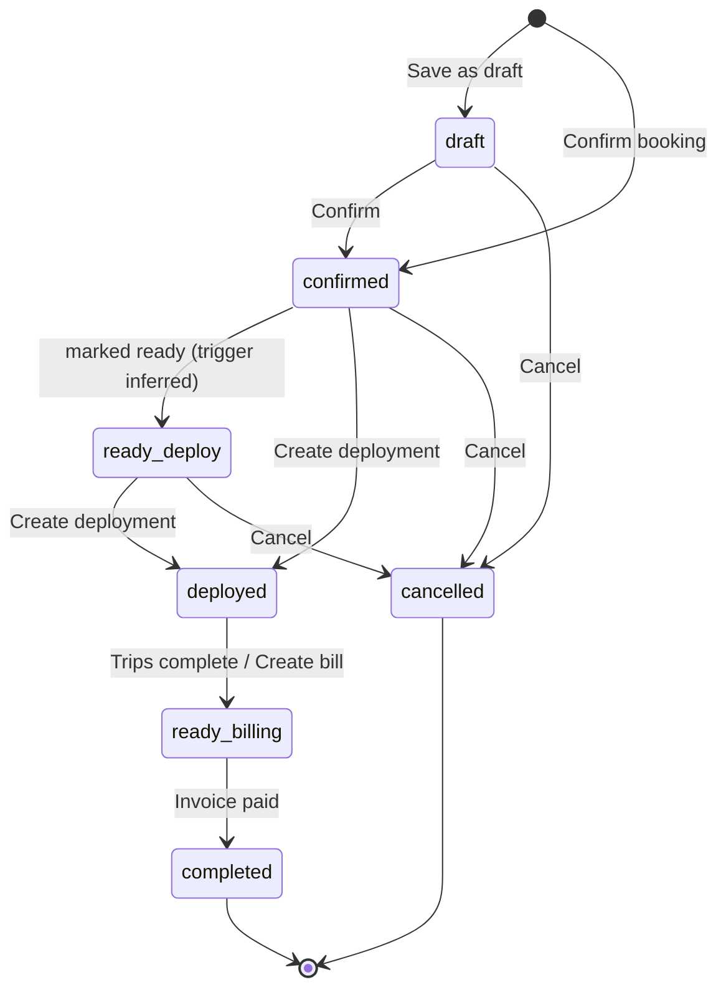

### 6.2 Deployment (slot assignment)
1. Slots generated from booking lines (one per vehicle unit) with shift.
2. Assign vehicle (same category, available) and driver (available) per slot; Replace vehicle if needed.
3. Progress: Not started → In progress → Ready to dispatch (all assigned).
4. LPO awaited (send reminder) / received.
5. Generate roadmap PDF (requires 100 % assignment); dispatch.
6. Add extra charges (waiting time, extra mileage) during/after trip.
7. Upload signed roadmap → deployment completed → feeds billing.

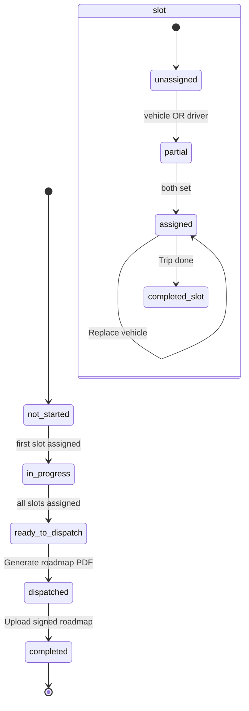

### 6.3 Deployment voucher (per vehicle trip)
1. Voucher created at dispatch with PO, client, driver, vehicle, start KM, day rate → `ongoing`.
2. Record return: end KM (≥ start), fuel amount, mission due, comment/observation → `returned` (or `not_returned`).
3. Invoiced → `invoiced`.

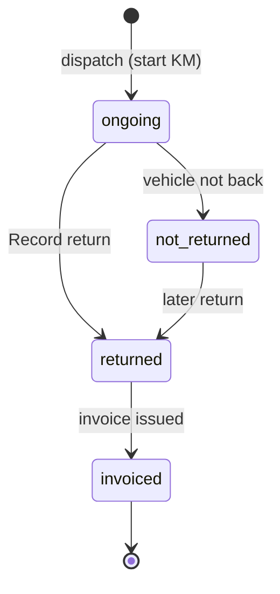

### 6.4 Maintenance job (MNT)
1. New job (vehicle, date in, category/type, garage, provider, labor) → `waiting_approval`, payment `unpaid`.
2. Add spare parts from catalogue (`pending`); approve/reject each (or Approve all).
3. "Approve parts & start" → `pending` (blocked while pending parts); "Start work" → `in_progress`; "Mark completed" → `completed`.
4. Record payment (method, currency, amount, receipt) → payment `partial`/`paid`; job closed & paid.

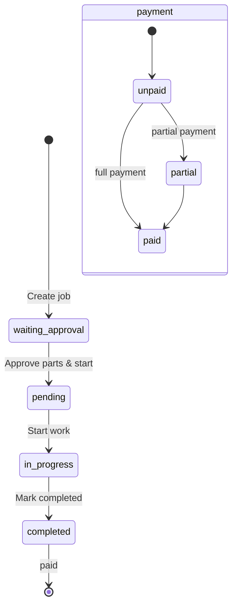

### 6.5 Garage intake (GRG)
1. Receptionist check-in → `received` (auto GRG number).
2. Mechanic Review (diagnosis, faults, recommended repair, parts needed, labour notes, ETA) → `under_review`, parts `requested`.
3. Work Progress: manager approves/rejects parts; mechanic sets `in_repair` / `waiting_parts`, ticks tasks, posts comments.
4. Mark as completed → `completed`; Work-Done form.
5. Gate pass → `released` (gate pass number, released date).

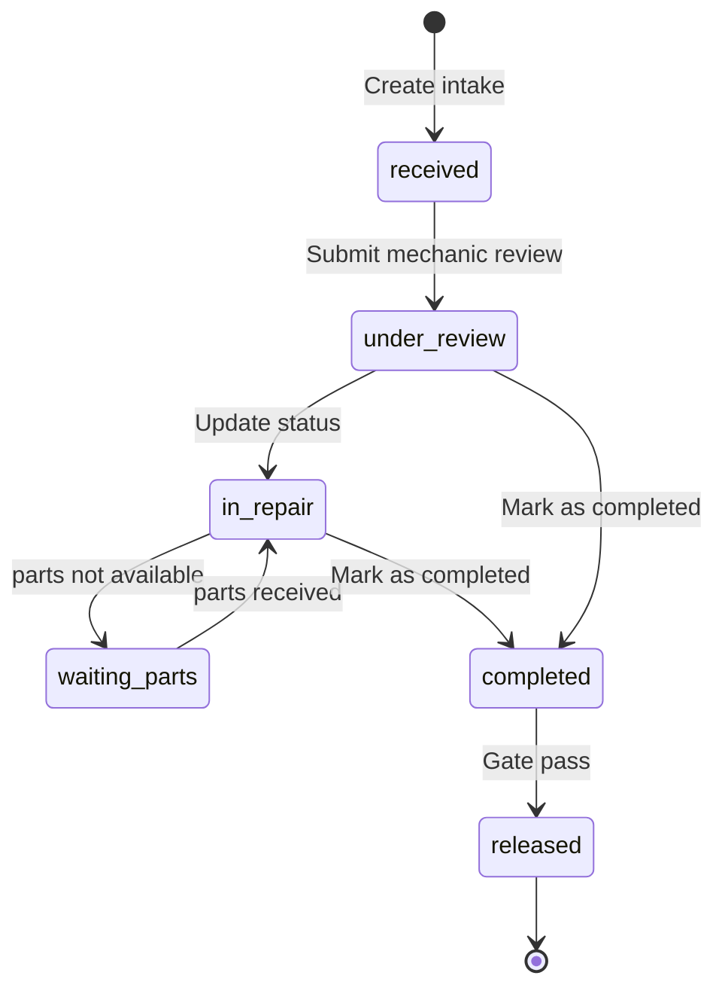

### 6.6 Commitment
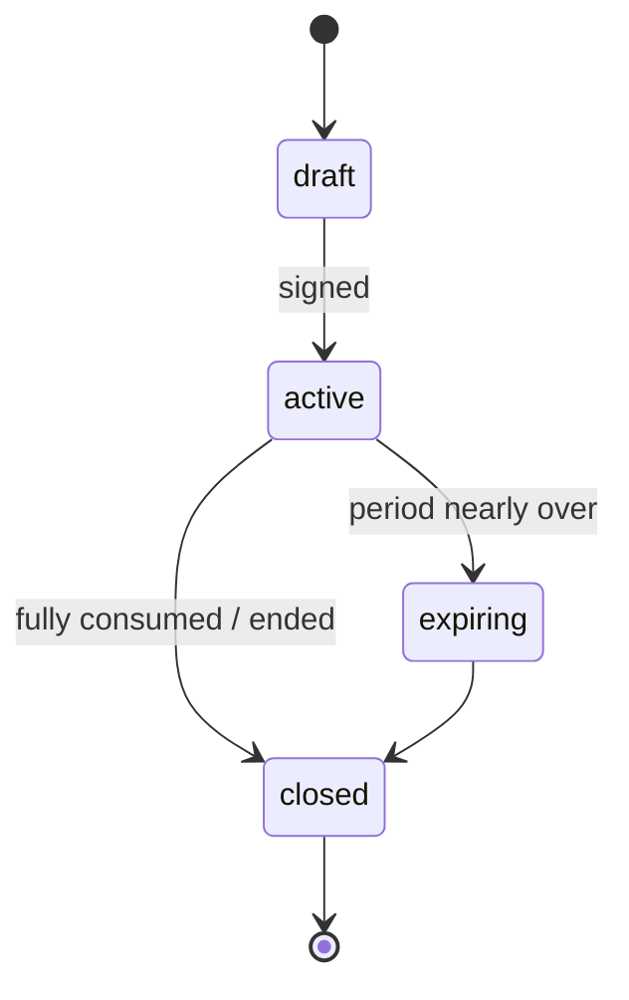

### 6.7 LPO
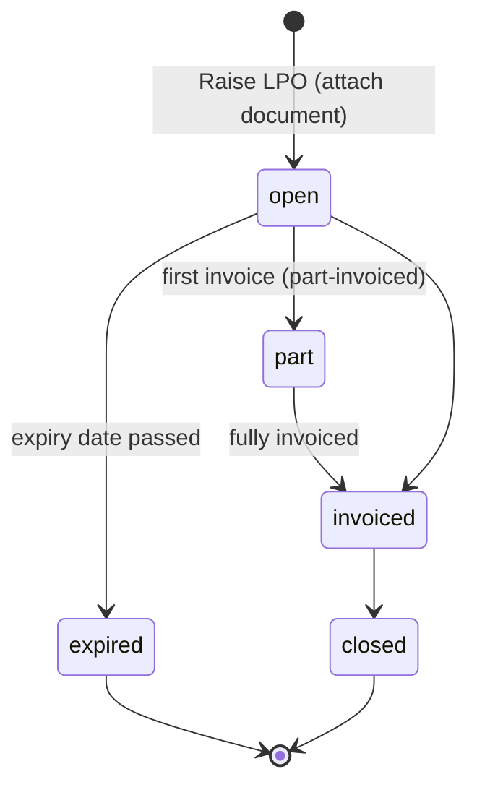

### 6.8 Invoice / bill
1. Completed deployment appears in "Ready for Billing".
2. Generate invoice: lines auto-populated (+ extras), terms, discount → `draft`.
3. Edit lines/discount in draft; Send → `sent` (due = date + terms).
4. Record payment(s) → `partial` until Σ ≥ grand total → `paid`; past due with balance → `overdue`.

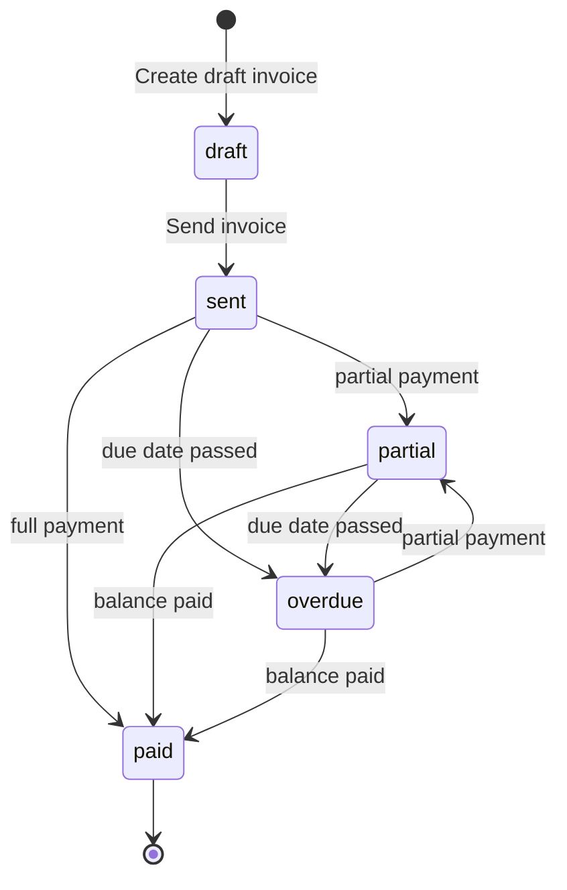

### 6.9 Expense
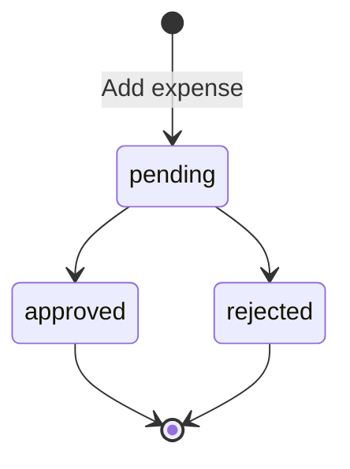

### 6.10 Traffic fine
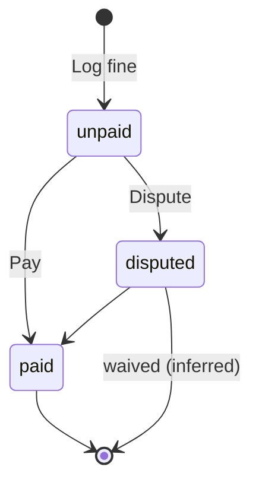

### 6.11 Accident
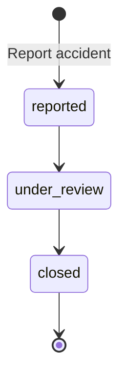

### 6.12 Certificate
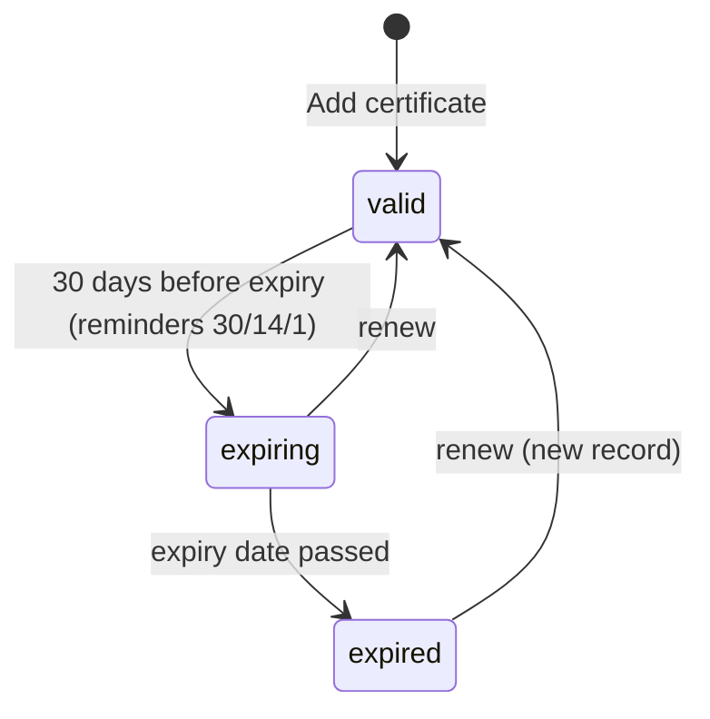

### 6.13 Spare parts & stock
1. Add part to catalogue (SKU, unit price, opening stock, reorder level).
2. Stock in (reference PO-…) / stock out (reference MNT-…) via Stock Movements; status ok/low/out derived.
3. Job parts approved → issued from stock (inferred link).

### 6.14 User invitation
Invite (name, email, role) → `Invited` → `Active`; audit entry created.

---

## 7. Roles inventory

| Role (source) | Evidence | Screens likely used (inferred) |
|---|---|---|
| **Administrator** | shell user card; USERS seed; invite options | All; Company Profile, Users & Roles, Audit Log, Notifications |
| **Fleet Manager** | ROLES, USERS seed | Dashboard, Vehicles, Drivers, Availability, Maintenance Jobs/New Job/Job Detail (approve parts), Spare Parts, Stock, Certificates, Reports |
| **Dispatcher** | ROLES, USERS seed | Bookings, New Booking, Booking Detail, Deployments, Deployment Detail, Deployment Voucher, Availability, Clients, LPOs (attach) |
| **Accountant** | ROLES, USERS seed; audit "Recorded payment" | Bills, Generate Invoice, Invoice Detail, Payments, Expenses (approve), Fuel Log, Commitments, LPOs, Job Detail payment, Deployment Report |
| **Compliance Officer** | ROLES, USERS seed | Certificates, Traffic Fines, Accidents, Notifications |
| **Viewer** | ROLES, USERS seed | Read-only everywhere; reports; print/PDF |
| **Receptionist** (garage persona) | badge on Vehicle Intake | Vehicle Intake, Garage Dashboard |
| **Mechanic** (garage persona) | Mechanic Review badge, comments role "Mechanic", MECHANICS lists | Mechanic Review, Work Progress, Job Detail |
| **Workshop/garage manager** (inferred) | "Approved by {j.manager}" | Work Progress (approve parts), Garage Dashboard |
| **Account manager** | voucher/report field | Deployment Voucher (record return), Deployment Report |
| **Fuel manager** | Fuel GSL Report filter | Fuel GSL Report, Fuel Log |
| **Stores** | stock "by: Stores", expense "Paid by: Stores" | Spare Parts, Stock Movements |
| **System** | audit actor | automated alerts |

No permission matrix exists in the prototype; RBAC granularity is undefined.

---

## 8. Numbering / reference formats observed

| Entity | Format | Examples | Generation rule in source |
|---|---|---|---|
| Booking | `BK-YYYY-NNNN` | BK-2026-0012 | `nextRef()` = max seq + 1, 4-digit pad, year fixed 2026 |
| Commitment | `CMT-NNNN` | CMT-0042, CMT-0071 | max + 1, 4-digit |
| LPO | `LPO-YYYY-NNNN` | LPO-2026-0188 (also "LPO-2026-118" on Deployment Detail — inconsistent) | max + 1 |
| Maintenance job | `MNT-YYYY-NNNN` | MNT-2026-0046 … 0048 | `M.nextRef()` |
| Invoice / bill | `INV-YYYY-NNNN` | INV-2026-0042; Booking Detail derives `INV-2026-0{last 3 of booking}` | `B.nextRef()` |
| Payment | `PAY-NNNN` | PAY-3301, PAY-7741; job demo `PAY-{last4 of MNT ref}`; random `PAY-1000–9999` if blank | user-entered or random |
| Purchase order (stock in) | `PO-NNNN` | PO-0231, PO-0228, PO-0225 | — |
| Deployment voucher | `LIMOZ/NNNNNN/YYYY` | LIMOZ/000628/2026 | sequential 6-digit per year |
| Garage record | `GRG/NNNNNN/YYYY` | GRG/000110/2026, GRG/000114/2026 | `G.nextJobNo()` |
| Gate pass | unknown (`j.gatePass`) | — | — |
| Fuel/Technical voucher | "Vch No"; fuel requisition "NFR" | — (data file missing) | — |
| Vehicle plate | `RAD NNN L` / `RAGNNNL` | RAD 408 C, RAG337B | Rwandan plates |
| Driver licence | `RW-DL-NNNNN` | RW-DL-44120 | — |
| Client / driver / owner code | numeric prefix + name | "420002 GARDEN FRESH Ltd", `d.client.id`, `d.driver.id` | — |
| TIN | `NNN NNN NNN` | 101 922 330 | — |
| SKU | `AA-NNNN` or `SKU-NNNNN` | BP-1180, EO-5000; auto `SKU-{Date.now()%100000}` | upper-cased |
| Roadmap file | `roadmap-{bookingRef}-signed.pdf` | roadmap-BK-2026-0012-signed.pdf | — |
| Bank account | `NNN-NNNN-NNNN` | 000-4471-2208 | — |

---

## 9. Missing / ambiguous requirements

**Modules & scope**
1. `trips` and `routes` modules are disabled — no trip entity, route master, stops, distances or trip-level status; Dashboard shows "Route: Kigali → Huye, Dep. 08:30" with no backing model.
2. Two overlapping maintenance models (MNT jobs with Internal/External garage vs GRG garage workshop records) with different status sets, part-status vocabularies (`pending/approved/rejected` vs `requested/approved/rejected`) and numbering; relationship between them undefined. Garage also serves third-party owners (dept, external client) — billing of garage work to those owners is not modelled.
3. Two vehicle category taxonomies (Minibus/Coaster/Coach/Cargo Van vs voucher CAT 3/COASTER/SUV).
4. Two fuel datasets (Fuel Log entries vs Fuel GSL vouchers with NFR, agence, supplier, owner) — unclear which is master.
5. Deployment ↔ Deployment Voucher relationship (one voucher per slot/vehicle?) and voucher creation trigger are not shown; `Deployments` list is merely a booking projection.
6. Gate Pass and Work-Done Form documents exist only as links; their fields are unknown.
7. Bill detail / new bill pages are 404 — billing is only invoice-based.

**Data & rules not defined**
8. Availability check ignores dates (counts `status==='available'`); production needs date-range conflict detection, reservations/holds on confirm, and release on cancel.
9. Pricing: unit price is free text per line; no rate card by category/type (Full day/Half day/Per trip/Monthly), no day-rate source for vouchers (`dayRate`), no owner-share rule (`ownerAmount`), no "mission due" definition, no "Selection amount" definition, no waiting-time/extra-mileage tariffs.
10. Multi-currency: hard-coded 1 USD = 1300 RWF; no rate table, rate date, or per-invoice rate; KPIs sum RWF-converted USD.
11. VAT: fixed 18 % with per-line tax; no exemption handling, no withholding tax, no Rwanda EBM/RRA e-invoicing integration.
12. Invoice numbering derived from booking ref in demo; no credit notes, no partial-invoicing of LPO despite `part` status; "Edit" on a sent invoice reverts to draft (should be forbidden/versioned).
13. Commitment `consumed` calculation and LPO ↔ booking ↔ invoice linkage (which value draws down, when) are unspecified.
14. Odometer: captured in Fuel Log, New Job, Vehicle Intake, voucher start/end KM — no central odometer history, no monotonic validation, no service interval configuration ("Service overdue +2,400 km").
15. No GPS/telematics, fuel sensors, geofencing or live vehicle position.
16. No driver documents (licence expiry, medical, photo), driver availability calendar, shift rules, allowances linked to deployments.
17. No vehicle master details (VIN, year, seats, owner, insurance policy link, photos) beyond plate/category/brand; `Add vehicle` not implemented.
18. Certificate status is user-set rather than derived from expiry; no document upload for certificates/fines/accidents; no accident cost/insurance claim fields.
19. Expenses: no approver identity, no link to vehicle/deployment/driver, no receipts.
20. Payments module has no create form and no link to invoices/jobs; vendor master absent (vendors only as names).
21. Stock: no purchase order entity (PO-0231 is a free-text ref), no supplier, no unit cost on receipt, no issue-to-job linkage, no store locations.
22. Users & roles: no permission matrix, no password/SSO, no per-module access; roles differ between `TenantData.ROLES` (5) and invite dialog (6, adds Administrator).
23. Notifications: preferences only; no inbox for the bell icon, no e-mail/push delivery spec; certificate reminders at 30/14/1 days need a scheduler.
24. Audit log: entries are free text; no entity/ID linkage, no before/after values.
25. Dates are display strings ("10 Jun") without year in bookings; "today" is hard-coded; timezone handling unspecified.
26. Pagination, sorting and export are non-functional; export format (CSV/XLSX/PDF) unspecified.
27. Roadmap PDF and voucher/invoice PDF generation and signed-document storage are not specified (templates, storage, retention).
28. Terminology settings (relabel Vehicle/Driver/…) exist in data but no UI; backend must support tenant-specific labels.
29. Client balance ("Current client balance … Dr") implies a client ledger/statement that has no screen.
30. Shift vocabulary (`Day/Night/Full`) is assigned automatically in the prototype — business rule for shift selection and shift-based pricing undefined.
