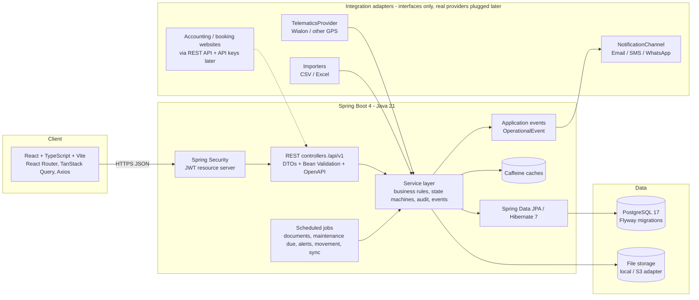

# LIMOZ Rwanda Fleet Operations - Requirements & Architecture

This document converts the reference-application analysis (`01-reference-application-analysis.md`) and the
project brief into the specification the backend implements. It is the contract the React frontend will be built
against.

## 1. Objective

One operational source of truth for the LIMOZ Rwanda fleet, answering at any time: how many vehicles are available,
assigned, on trip or in the workshop; which have GPS/fuel-sensor problems or have not moved; how far each moved;
which drivers are assigned; what requires maintenance; which documents expired; fuel consumption and cost per
vehicle; completed trips; upcoming bookings; incidents; utilisation; and the abnormalities management must act on.

## 2. Functional scope (modules)

| # | Module | Reference screens covered | Backend package | API root |
|---|--------|---------------------------|-----------------|----------|
| 1 | Authentication & users | Users & Roles | `auth`, `user`, `security` | `/api/v1/auth`, `/users`, `/roles` |
| 2 | Company profile & settings | Company Profile (profile, terminology, VAT, currency, timezone), thresholds | `settings` | `/api/v1/settings` |
| 3 | Vehicles & categories | Vehicles, Availability calendar (with dispatch) | `vehicle` | `/api/v1/vehicles`, `/vehicle-categories` |
| 4 | Drivers | Drivers | `driver` | `/api/v1/drivers` |
| 5 | Vehicle-driver assignment | Drivers "Assigned vehicle" | `assignment` | `/api/v1/assignments` |
| 6 | Documents & certificates | Certificates | `document` | `/api/v1/documents`, `/document-types` |
| 7 | Clients, commitments, LPOs | Clients, Commitments, LPOs | `customer` | `/api/v1/customers`, `/commitments`, `/purchase-orders` |
| 8 | Bookings, deployments, vouchers | Bookings, New Booking, Booking Detail, Deployments, Deployment Detail, Deployment Voucher | `booking` | `/api/v1/bookings`, `/dispatch`, `/vouchers` |
| 9 | Trips | (disabled in prototype, required by brief) | `trip` | `/api/v1/trips` |
| 10 | Fuel | Fuel Log, Fuel GSL report | `fuel` | `/api/v1/fuel` |
| 11 | Maintenance & garage | Jobs, New Job, Job Detail, Garage Dashboard, Vehicle Intake, Mechanic Review, Work Progress | `maintenance` | `/api/v1/maintenance`, `/workshops`, `/service-types` |
| 12 | Spare parts & stock | Spare Parts, Stock Movements | `maintenance.inventory` | `/api/v1/spare-parts`, `/stock-movements` |
| 13 | Incidents, accidents, fines | Accidents, Traffic Fines | `incident` | `/api/v1/incidents`, `/traffic-fines` |
| 14 | Finance | Bills, Generate Invoice, Invoice Detail, Payments, Expenses | `finance` | `/api/v1/invoices`, `/payments`, `/expenses` |
| 15 | Telematics & movement | (brief: GPS, daily movement analysis) | `telematics` | `/api/v1/telematics`, `/movement` |
| 16 | Notifications & alert centre | Notifications, dashboard "Priority actions" | `notification` | `/api/v1/notifications`, `/alerts` |
| 17 | Dashboard | Dashboard | `dashboard` | `/api/v1/dashboard` |
| 18 | Reports & exports | Technical, Fuel GSL, Deployment reports + brief reports | `reporting` | `/api/v1/reports` |
| 19 | Search | Global search box | `search` | `/api/v1/search` |
| 20 | Imports | (brief) CSV/Excel import | `importer` | `/api/v1/imports` |
| 21 | Audit log | Audit Log | `audit` | `/api/v1/audit-logs` |
| 22 | Attachments | LPO document, receipts, photos | `storage` | `/api/v1/attachments` |

## 3. Non-functional requirements

* **Security**: stateless JWT (HS256, 15 min access / 14 day rotating refresh), BCrypt(12) passwords, permission
  codes enforced with `@PreAuthorize` on every endpoint, login throttling + account lockout, revocation on logout,
  no secrets in source (`.env`), CORS allow-list, security headers, CSRF not applicable (no cookies).
* **Data integrity**: PostgreSQL constraints (FK, unique, CHECK), optimistic locking (`version`), explicit state machines,
  odometer journal, soft delete for operational records, audit log on every mutation.
* **Performance**: server-side pagination everywhere, indexes on every filter/foreign key, entity graphs (no N+1),
  aggregate queries for dashboards/reports, Caffeine caches (settings, reference data, dashboard 60 s, user status).
* **Operability**: Flyway migrations, actuator health/metrics/prometheus, structured logs, Docker image (non-root,
  layered), docker-compose, GitHub Actions CI (tests on embedded PostgreSQL) and CD (GHCR image, tagged deploy).
* **Time**: all timestamps UTC in the database; business days computed in `Africa/Kigali` (configurable).
* **Extensibility**: new modules follow `docs/dev-conventions.md`; integrations via interfaces
  (`TelematicsProvider`, `NotificationChannel`, `FileStorage`, `AlertScanner`, `OperationalEvent`).

## 4. System architecture



### Backend layering (per module)

`Controller (DTO in/out, @PreAuthorize)` -> `Service (@Transactional, rules, audit, events)` ->
`Repository (JPA + Specifications + aggregate queries)` -> `Entity (mapped to Flyway schema)`.
Cross-module calls go through the owning module's service (`VehicleService.loadActive`, `OdometerService.record`,
`DocumentService.missingOrExpiredRequiredDocuments`...), never through another module's repository.

## 5. Authentication & authorization model

```mermaid
sequenceDiagram
    participant U as User (React)
    participant A as /api/v1/auth
    participant S as Spring Security
    participant R as Protected endpoint
    U->>A: POST /login {email, password}
    A->>A: throttle check, BCrypt verify, lockout counter, audit LOGIN
    A-->>U: {accessToken (JWT 15m), refreshToken (opaque, hashed in DB), user{roles, permissions}}
    U->>R: GET /vehicles  Authorization: Bearer <jwt>
    S->>S: verify signature/expiry, jti not revoked, user active & tokenVersion unchanged (cached 60s)
    S->>R: AuthenticatedUser + authorities (ROLE_x + permission codes)
    R->>R: @PreAuthorize("hasAuthority('VEHICLE_READ')")
    U->>A: POST /refresh {refreshToken}  (rotation; reuse of an old token revokes the family)
    U->>A: POST /logout  (jti revoked, refresh tokens revoked)
```

Roles (system, editable permission sets): SUPER_ADMIN, IT_ADMIN, MANAGEMENT, FLEET_MANAGER, FLEET_OFFICER,
DISPATCHER, WORKSHOP_MANAGER, TECHNICIAN, DRIVER, FINANCE, COMPLIANCE_OFFICER, VIEWER. Permissions are listed in
`V2__reference_data_rbac_and_settings.sql` / `security.Permissions`. Administrators can create custom roles.

## 6. Database entity model

```mermaid
erDiagram
    USERS ||--o{ USER_ROLES : has
    ROLES ||--o{ USER_ROLES : grants
    ROLES ||--o{ ROLE_PERMISSIONS : contains
    PERMISSIONS ||--o{ ROLE_PERMISSIONS : in
    USERS ||--o{ REFRESH_TOKENS : owns
    USERS ||--o{ AUDIT_LOGS : performs
    USERS ||--o{ NOTIFICATIONS : receives

    VEHICLE_CATEGORIES ||--o{ VEHICLES : classifies
    VEHICLES ||--o{ ODOMETER_LOGS : journals
    VEHICLES ||--o{ VEHICLE_DOCUMENTS : holds
    DOCUMENT_TYPES ||--o{ VEHICLE_DOCUMENTS : types
    DOCUMENT_TYPES ||--o{ DRIVER_DOCUMENTS : types
    DRIVERS ||--o{ DRIVER_DOCUMENTS : holds
    VEHICLES ||--o{ VEHICLE_ASSIGNMENTS : assigned_in
    DRIVERS ||--o{ VEHICLE_ASSIGNMENTS : assigned_in
    VEHICLES ||--o| TELEMATICS_DEVICES : tracked_by
    VEHICLES ||--o{ VEHICLE_POSITIONS : reports
    VEHICLES ||--o{ DAILY_MOVEMENT_SUMMARIES : summarised

    CUSTOMERS ||--o{ COMMITMENTS : signs
    CUSTOMERS ||--o{ BOOKINGS : requests
    COMMITMENTS ||--o{ BOOKINGS : draws_down
    CUSTOMERS ||--o{ PURCHASE_ORDERS : raises
    COMMITMENTS ||--o{ PURCHASE_ORDERS : backs
    BOOKINGS ||--o{ PURCHASE_ORDERS : authorised_by
    BOOKINGS ||--o{ BOOKING_LINES : contains
    BOOKING_LINES ||--o{ BOOKING_SLOTS : expands_to
    VEHICLE_CATEGORIES ||--o{ BOOKING_LINES : requested
    BOOKINGS ||--o{ BOOKING_EXTRA_CHARGES : adds
    VEHICLES ||--o{ BOOKING_SLOTS : fills
    DRIVERS ||--o{ BOOKING_SLOTS : drives
    BOOKING_SLOTS ||--o| DEPLOYMENT_VOUCHERS : documented_by
    BOOKING_SLOTS ||--o| TRIPS : executes_as
    VEHICLES ||--o{ TRIPS : performs
    DRIVERS ||--o{ TRIPS : drives
    CUSTOMERS ||--o{ TRIPS : for

    VEHICLES ||--o{ FUEL_TRANSACTIONS : refuels
    DRIVERS ||--o{ FUEL_TRANSACTIONS : refuelled_by
    VEHICLES ||--o{ MAINTENANCE_RECORDS : serviced_in
    WORKSHOPS ||--o{ MAINTENANCE_RECORDS : performs
    MAINTENANCE_RECORDS ||--o{ MAINTENANCE_TASKS : has
    MAINTENANCE_RECORDS ||--o{ MAINTENANCE_PARTS : uses
    MAINTENANCE_RECORDS ||--o{ MAINTENANCE_COMMENTS : timeline
    SERVICE_TYPES ||--o{ MAINTENANCE_TASKS : classifies
    SPARE_PARTS ||--o{ MAINTENANCE_PARTS : supplies
    SPARE_PARTS ||--o{ STOCK_MOVEMENTS : moves
    VEHICLES ||--o{ MAINTENANCE_SCHEDULES : planned
    SERVICE_TYPES ||--o{ MAINTENANCE_SCHEDULES : interval

    VEHICLES ||--o{ INCIDENTS : involved_in
    DRIVERS ||--o{ INCIDENTS : involved_in
    INCIDENTS ||--o{ INCIDENT_UPDATES : history
    INCIDENTS ||--o{ MAINTENANCE_RECORDS : repaired_by
    VEHICLES ||--o{ TRAFFIC_FINES : fined
    DRIVERS ||--o{ TRAFFIC_FINES : responsible

    CUSTOMERS ||--o{ INVOICES : billed
    BOOKINGS ||--o{ INVOICES : invoiced_by
    INVOICES ||--o{ INVOICE_LINES : contains
    INVOICES ||--o{ PAYMENTS : settled_by
    EXPENSE_CATEGORIES ||--o{ EXPENSES : classifies
    EXPENSES ||--o{ PAYMENTS : paid_by
    MAINTENANCE_RECORDS ||--o{ PAYMENTS : paid_by
    TRAFFIC_FINES ||--o| PAYMENTS : paid_by
    ATTACHMENTS ||--o{ VEHICLE_DOCUMENTS : scan
    ALERTS }o--|| VEHICLES : about
```



Full column definitions, constraints and indexes: `src/main/resources/db/migration/V1..V7`.

## 7. Core business rules (enforced in services, tested)

* Plate numbers unique (case/space-insensitive); duplicate -> 409.
* Odometer never decreases except through an administrator-approved correction, journaled with reason.
* A vehicle and a driver can each have only one ACTIVE assignment; assignment history is never overwritten.
* Dispatch validation: vehicle dispatchable (AVAILABLE/ASSIGNED/RESERVED), not in maintenance, no overlapping
  slot/trip, required documents valid; driver available, licence valid, no conflicting slot/trip.
* ON_TRIP / IN_MAINTENANCE statuses are set only by the trip and maintenance workflows.
* Trip distance = end − start odometer; duration = ended − started; fuel cost = litres × price; L/100 km and km/L
  computed from the previous fill; maintenance cost = labour + approved parts + other; invoice total =
  subtotal − discount + tax; voucher institution amount = effective days × day rate; net = owner − fuel.
* Document status VALID / EXPIRING_SOON / EXPIRED recomputed nightly with configurable warning days.
* Preventive schedules: next = last + interval (km and/or days); DUE_SOON / OVERDUE thresholds configurable.
* Every status lifecycle (booking, slot, voucher, trip, maintenance, incident, fine, invoice, expense, commitment,
  LPO) rejects illegal transitions with HTTP 422 and a stable error code.

## 8. REST API plan

Base path `/api/v1`, JSON, bearer auth, pagination `page/size/sort`, filters as query parameters,
errors as `ApiError`. The live, complete contract is in Swagger UI (`/swagger-ui.html`) and `/v3/api-docs`.

| Area | Endpoints (summary) |
|------|---------------------|
| auth | `POST /auth/login`, `/auth/refresh`, `/auth/logout`, `GET /auth/me`, `POST /auth/change-password` |
| users/roles | `GET/POST /users`, `GET/PUT /users/{id}`, `POST /users/{id}/enable|disable|reset-password`, `GET/POST/PUT/DELETE /roles`, `GET /roles/permissions` |
| settings | `GET/PUT /settings`, `GET /settings/company` |
| vehicles | `GET/POST /vehicles`, `GET/PUT/DELETE /vehicles/{id}`, `PATCH /vehicles/{id}/status`, `POST /vehicles/{id}/odometer/correct`, `GET /vehicles/{id}/odometer`, `/vehicles/{id}/documents|trips|fuel|maintenance|incidents|fines|costs|movement|assignments`, `GET /vehicles/summaries`, `/vehicle-categories` |
| drivers | `GET/POST /drivers`, `GET/PUT/DELETE /drivers/{id}`, `PATCH /drivers/{id}/status`, `/drivers/{id}/documents|trips|incidents|fines`, `GET /assignments/driver/{id}` |
| assignments | `POST /assignments`, `POST /assignments/{id}/end`, `GET /assignments/active`, `/assignments/vehicle/{id}` |
| documents | `GET /documents/vehicles?status=`, `GET /documents/drivers`, `POST /vehicles/{id}/documents`, `PUT/DELETE /vehicles/documents/{id}`, `/document-types` |
| customers | `GET/POST /customers`, `GET/PUT /customers/{id}`, `/customers/{id}/activate|deactivate|summary|commitments`, `/commitments`, `/purchase-orders` |
| bookings/dispatch | `GET/POST /bookings`, `GET/PUT /bookings/{id}`, `/bookings/{id}/confirm|cancel|complete|extra-charges`, `/bookings/slots/{id}/assign|unassign|depart|return`, `GET /dispatch/board`, `GET /dispatch/availability`, `/vouchers` |
| trips | `GET/POST /trips`, `GET/PUT /trips/{id}`, `/trips/{id}/dispatch|start|complete|cancel`, `GET /trips/active`, `GET /trips/mine` |
| fuel | `GET/POST /fuel`, `GET/PUT/DELETE /fuel/{id}`, `GET /fuel/summary` |
| maintenance | `GET/POST /maintenance`, `POST /maintenance/intake`, `/maintenance/{id}/review|approve|start|wait-parts|resume|complete|release|cancel|parts|tasks|comments|payments`, `GET /maintenance/garage/dashboard`, `/maintenance/schedules`, `/workshops`, `/service-types`, `/spare-parts`, `/stock-movements` |
| incidents | `GET/POST /incidents`, `/incidents/{id}/updates|investigate|resolve|close|reopen`, `/traffic-fines`, `/traffic-fines/{id}/pay|dispute|waive` |
| finance | `/invoices`, `POST /invoices/from-booking/{id}`, `/invoices/{id}/issue|cancel`, `GET /invoices/ready-to-bill`, `/payments`, `/payments/{id}/reverse`, `/expenses`, `/expenses/{id}/approve|reject|pay`, `/expense-categories`, `GET /finance/summary` |
| telematics | `/telematics/devices`, `POST /telematics/positions`, `POST /telematics/positions/import`, `GET /telematics/latest`, `GET /movement/daily`, `GET /movement/summary`, `POST /movement/recompute` |
| notifications/alerts | `GET /notifications`, `/notifications/unread-count`, `POST /notifications/{id}/read`, `GET /alerts`, `GET /alerts/summary`, `POST /alerts/{id}/acknowledge|resolve`, `POST /alerts/scan` |
| dashboard | `GET /dashboard/summary`, `/fleet-status`, `/utilization`, `/fuel-trend`, `/maintenance`, `/alerts`, `/trips-per-day`, `/distance-trend`, `/cost-by-vehicle`, `/availability-trend` |
| reports | `GET /reports/{report}?format=json|csv|xlsx|pdf&from&to&...` for daily-fleet, driver-utilization, trips, maintenance, maintenance-cost, fuel-consumption, fuel-variance, vehicle-cost, incidents, expired-documents, upcoming-service, fleet-availability, vehicle-movement, technical, fuel-gsl, deployment; `GET /vouchers/{id}/pdf` |
| search | `GET /search?q=` |
| imports | `POST /imports/vehicles|drivers|fuel` (CSV/XLSX) -> import summary with rejected rows |
| audit | `GET /audit-logs`, `GET /audit-logs/entity/{type}/{id}` |
| attachments | `POST /attachments`, `GET /attachments?ownerType&ownerId`, `GET /attachments/{id}/download` |

## 9. React page structure (to be built against this API)

```
/login
/dashboard
/vehicles, /vehicles/new, /vehicles/:id (tabs: overview, trips, fuel, maintenance, drivers, documents, incidents, costs, activity)
/vehicles/availability
/drivers, /drivers/:id (profile, assignments, trips, incidents, fines, documents)
/bookings, /bookings/new, /bookings/:id  (lines, slots/deployment, vouchers, invoice)
/dispatch (board), /vouchers/:id
/trips, /trips/:id
/clients, /clients/:id, /commitments, /purchase-orders
/maintenance (jobs), /maintenance/new, /maintenance/:id (work progress), /maintenance/intake, /maintenance/:id/review,
/garage (dashboard), /spare-parts, /stock-movements, /maintenance/schedules
/fuel, /incidents, /incidents/:id, /fines
/invoices, /invoices/:id, /invoices/new, /payments, /expenses
/certificates (documents), /telematics (map/devices), /movement
/reports/* , /alerts, /notifications
/settings/company, /settings/users, /settings/roles, /settings/thresholds, /settings/audit-log
```

## 10. Implementation roadmap (dependency order)

1. Platform: security, users/roles, settings, audit, storage, migrations, tests, CI  (done)
2. Master data: categories, vehicles, odometer journal, drivers, assignments, documents, customers  (done)
3. Operations: bookings, dispatch, vouchers, trips
4. Workshop & fuel: maintenance lifecycle, schedules, spare parts, fuel transactions
5. Compliance & finance: incidents, fines, commitments, LPOs, invoices, payments, expenses
6. Visibility: telematics ingestion, daily movement, notifications, alert centre
7. Management: dashboard aggregates, reports & exports, global search, imports, seed data
8. Frontend (React) against the OpenAPI contract; Docker compose with the frontend profile
